# Build the TAP Offer Wizard Using Collections

## Introduction

In this lab, you will create a two-step Offer Wizard in the Talent Acquisition Portal. The first step collects offer terms and stages them in an APEX Collection. The second step reviews the staged values, creates the offer row, sends an offer email, and removes the collection.

Estimated Time: 5 minutes

### Objectives

In this lab, you will:

- Create a two-step Offer Wizard.
- Add offer term items to the first wizard step.
- Populate the job ID from the selected candidate.
- Stage offer terms in an APEX Collection.
- Review and send the offer.
- Clean up the collection when the user finishes or cancels.

## Task 1: Create the Offer Wizard

The wizard replaces a single Offer Form with a guided flow that separates offer entry from review and send actions.

1. Open **App Builder**.

2. Open the **Talent Acquisition Portal** application.

    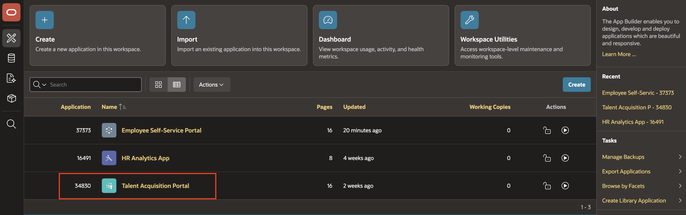

3. Click **Create Page**.

    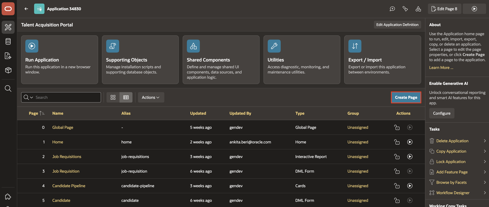

4. Select **Wizard**.

    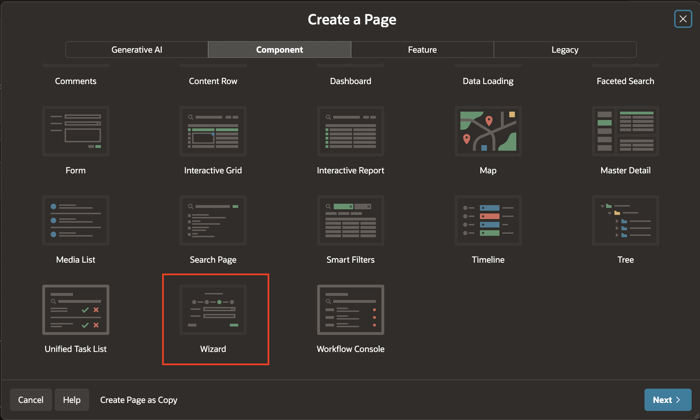

5. Select **Two-Step Wizard**.

6. Enter or select the following settings:

    - Page Definition > Wizard Name: **Offer Wizard**

    - Under Wizard Steps:

        | Step Number | Page Number | Name |
        | ---- | ---- | ---- |
        | 1 | 16 | Offer Terms |
        | 2 | 19 | Preview & Send |

        *Note - Delete rest of the steps. We only need 2 steps wizard for this task*

    - Navigation > Parent Navigation Menu Entry: **Offers**

    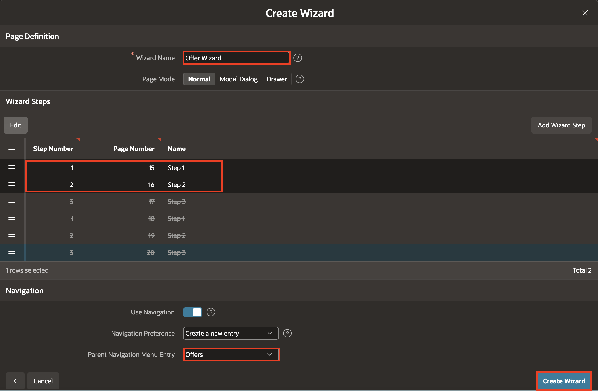

7. Click **Create Wizard**.

    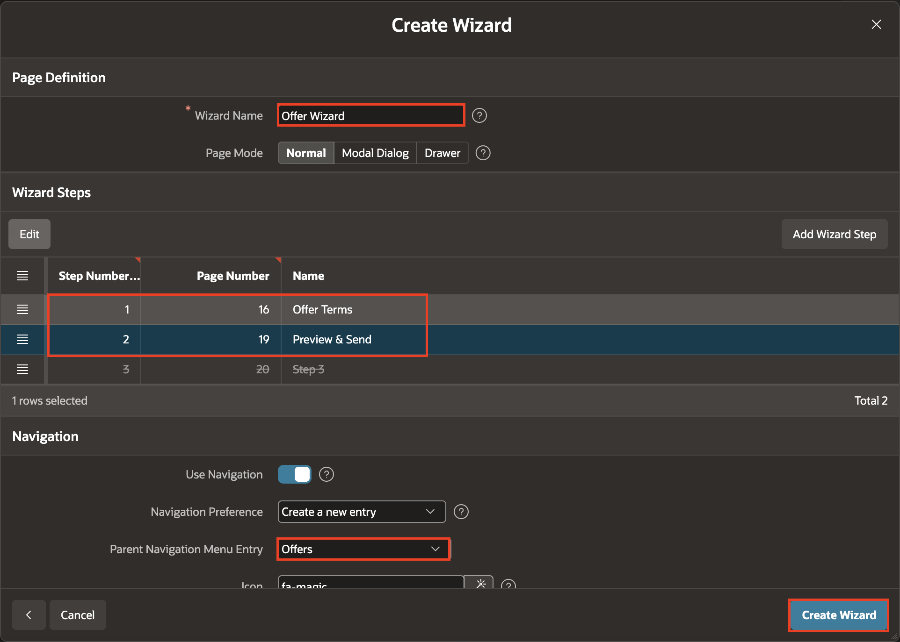

    *Note: The source uses page 16 for **Offer Terms** and page 19 for **Preview & Send**. Your generated page numbers may differ.*

## Task 2: Configure Step 1 for Offer Terms

Step 1 collects offer values and stages them in `OFFER_COLLECTION`.

1. Open the first wizard step in Page Designer.

2. In the left pane, right-click **Offer Terms** under **Wizard Sub Regions** and select **Create Page Item**.

    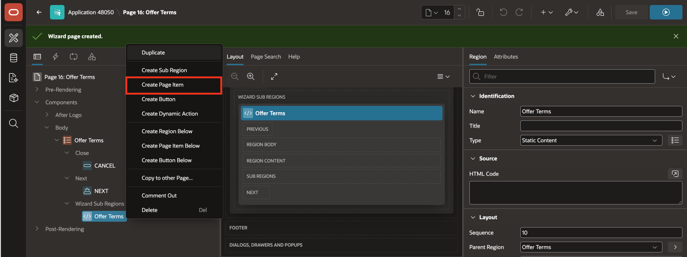

3. In the **Offer Terms** region, add the following items:

    | Item | Type |
    | --- | --- |
    | `P16_CANDIDATE_ID` | Select List |
    | `P16_JOB_ID` | Hidden |
    | `P16_SALARY` | Number Field |
    | `P16_START_DATE` | Date Picker |
    | `P16_EXPIRY_DATE` | Date Picker |

4. Select `P16\_CANDIDATE\_ID` page item and enter/select the following:

    - Under List of Values:

        - Type: **Shared Component**

        - List of Value: **TMS\_CANDIDATES.FIRST\_NAME**

    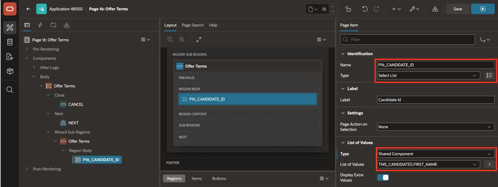

5. Right-click `P16_CANDIDATE_ID` page item and select **Create Dynamic Action**.

    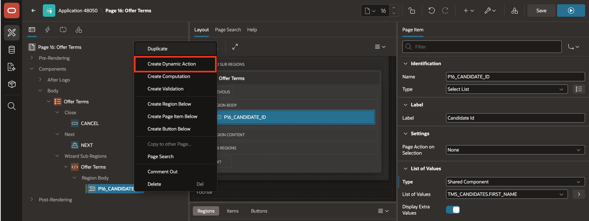

6. In the Property Editor, enter Name as **Derive Job Id**.

    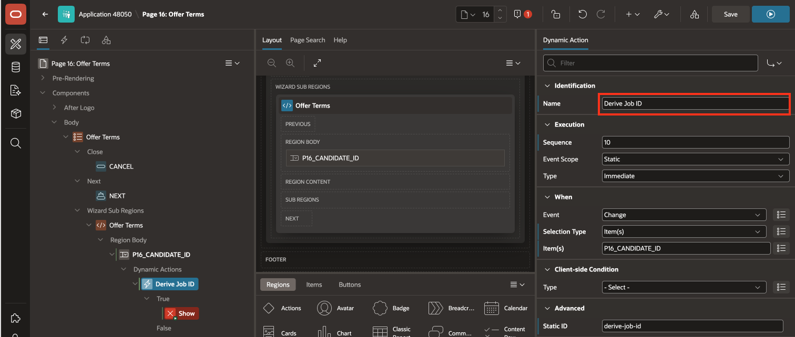

7. Select **Show** True action and enter/select the following:

    - Identification > Type: **Set Value**

    - Under Settings:

        - Set Type: **SQL Query**

        - SQL Query: Copy and Paste the following code:

        ```
        <copy>
        SELECT r.job_id
        FROM   tms_job_requisitions r
        JOIN   tms_candidates      c ON c.req_id = r.req_id
        WHERE  c.candidate_id = :P16_CANDIDATE_ID
        </copy>
        ```

        - Item to Submit: `P16_CANDIDATE_ID`

    - Under Affected Elements:

        - Selection Type: **Item(s)**

        - Item (s): `P16_JOB_ID`

    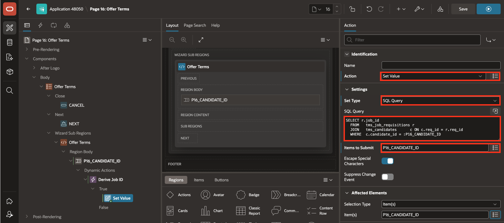

    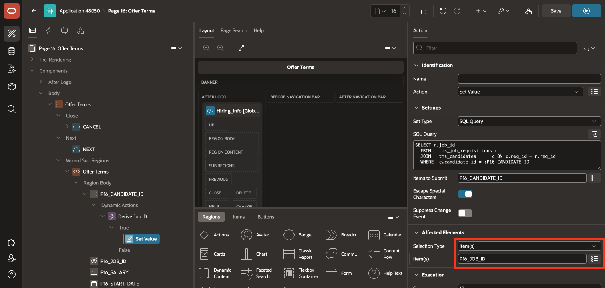

8. Select `P16_SALARY` and enter the following:

    - Appearance > Format mask: `FML999G999G999D00`

    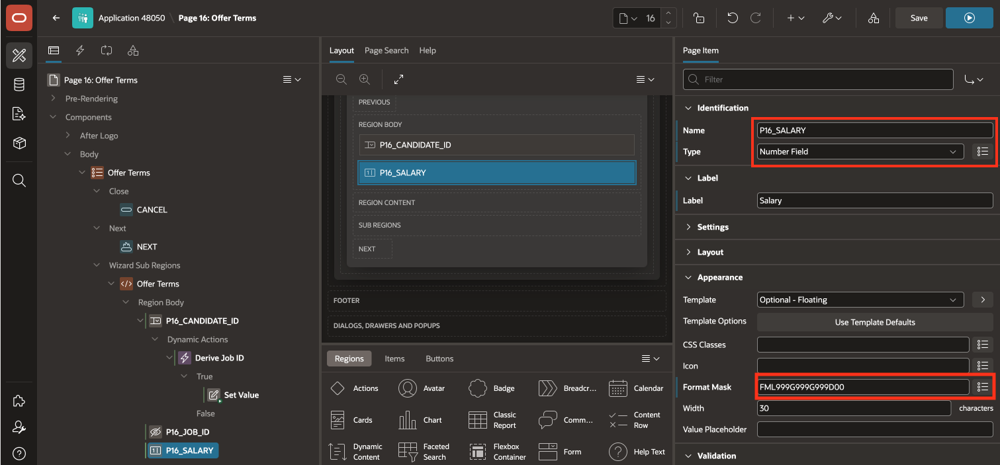

    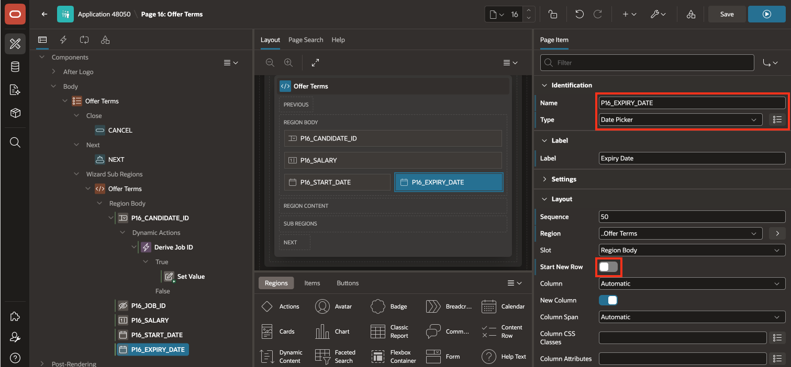

9. Navigate to **Processing** tab and right-click **Processing** and select **Create Process**.

    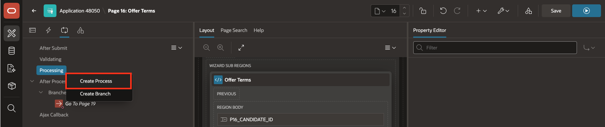

10. In the Property Editor, enter/select the following:

    - Identification > Name: **Stage to collection**

    - Source > PL/SQL Code: Copy and Paste the following code:

    ```
    <copy>
    BEGIN
        APEX_COLLECTION.CREATE_OR_TRUNCATE_COLLECTION('OFFER_COLLECTION');

        APEX_COLLECTION.ADD_MEMBER(
            p_collection_name => 'OFFER_COLLECTION',
            p_c001            => :P16_CANDIDATE_ID,
            p_c002            => :P16_JOB_ID,
            p_n001            => TO_NUMBER(REPLACE(:P16_SALARY, ',')),
            p_d001            => :P16_START_DATE,
            p_d002            => :P16_EXPIRY_DATE
        );
    END;
    </copy>
    ```

    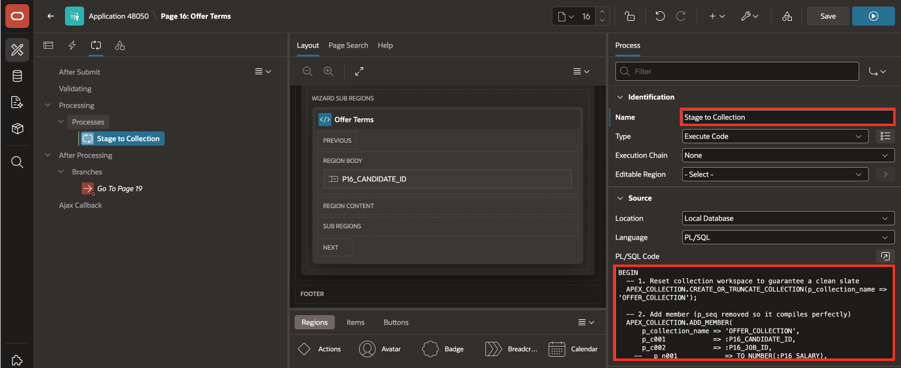

## Task 3: Add Step 1 Cancellation Logic

The cancel action must remove the staged offer collection before returning the user to the portal home page.

1. Navigate to **Rendering Pane**, right-click the **Cancel** button and select **Create Trigger Action**.

    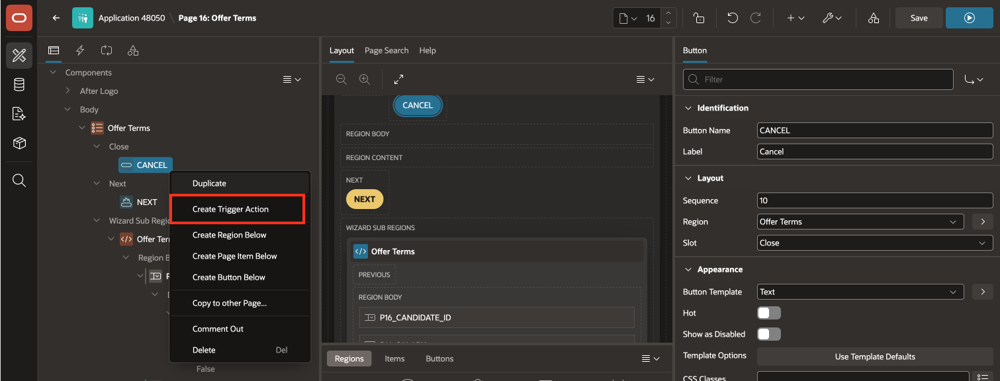

2. In the Property Editor, enter/select the following:

    - Settings > PL/SQL Code: Copy and paste the following code:

    ```
    <copy>
    IF APEX_COLLECTION.COLLECTION_EXISTS('OFFER_COLLECTION') THEN
        APEX_COLLECTION.DELETE_COLLECTION('OFFER_COLLECTION');
    END IF;

    APEX_UTIL.REDIRECT_URL('f?p=&APP_ID.:HOME:&SESSION.');
    </copy>
    ```

3. Click **Save**.

    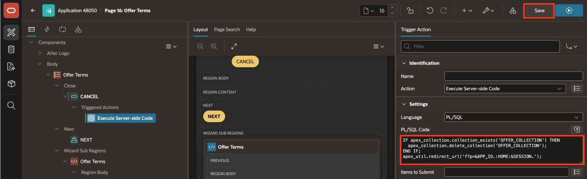

## Task 4: Configure Step 2 for Preview and Send

Step 2 shows the staged offer data, creates the final offer row, and sends the offer email.

1. From the Page Designer toolbar, navigate the Page Selector and select Page **19**: Preview & Send**.

    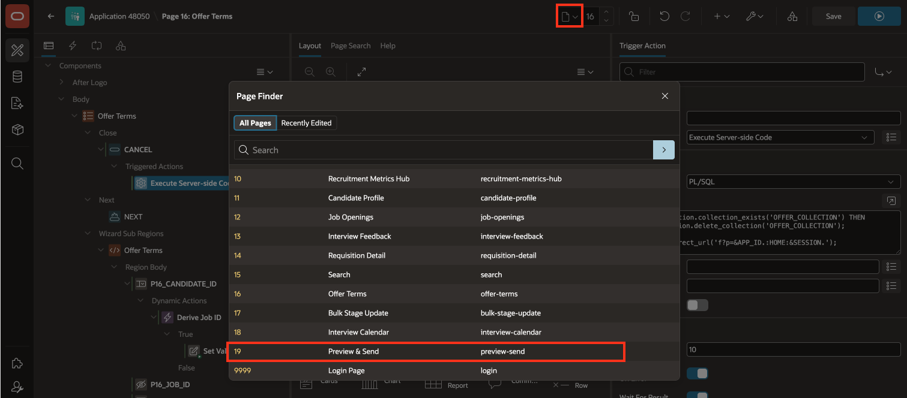

2. Navigate to **Wizard Sub Regions**, right-click **Preview & Send** region and select **Create Page Item**.

    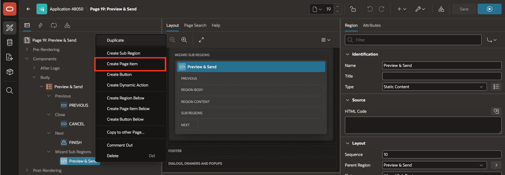

3. Add the following page items:

    | Name | Type |
    | --- | --- |
    | `P19_CANDIDATE` | Display Only |
    | `P19_JOB` | Display Only |
    | `P19_SALARY` | Display Only |
    | `P19_START_DATE` | Display Only |
    | `P19_EXPIRY_DATE` | Display Only |
    | `P19_OFFER_TO` | Hidden |
    | `P19_OFFER_ID`| Hidden |

    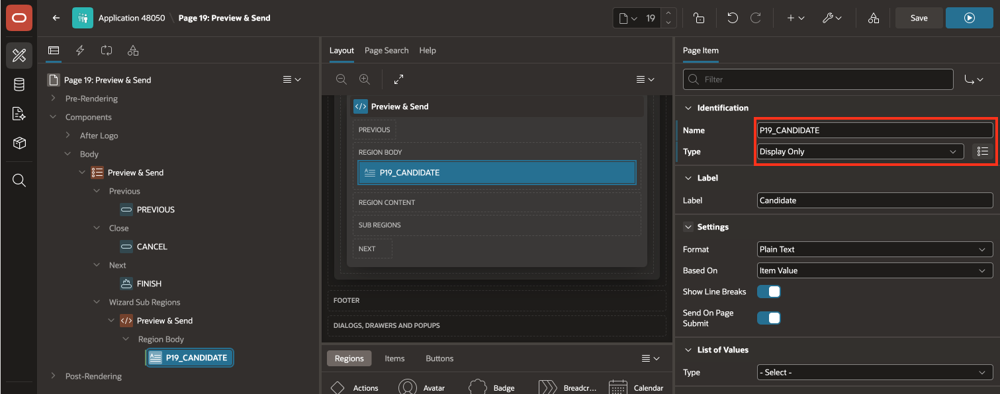

4. Select `P19_CANDIDATE` page item and enter/select the following:

    - Under Source:

        - Type: **Null**

        - Used: **Always, replacing any existing value in session state**

    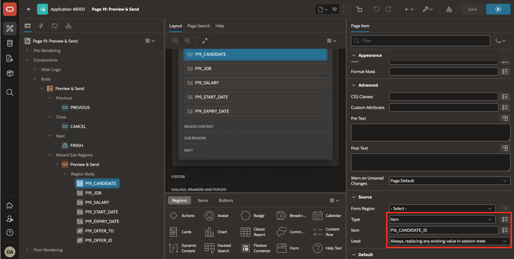

    - Under Default:

        - Type: **SQL Query (return single value)**

        - SQL Query (return single value: Copy and paste the following code:

        ```
        <copy>
        SELECT first_name || ' ' || last_name FROM tms_candidates WHERE candidate_id = :P16_CANDIDATE_ID
        </copy>
        ```

    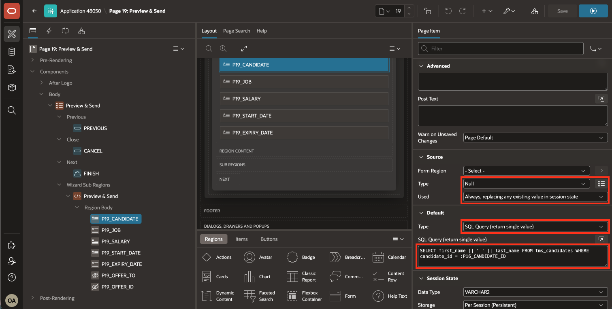

5. Select `P19_JOB` page item and enter/select the following:

    - Under Source:

        - Type: **Null**

        - Used: **Always, replacing any existing value in session state**

    - Under Default:

        - Type: **SQL Query (return single value)**

        - SQL Query (return single value: Copy and paste the following code:

        ```
        <copy>
        SELECT title FROM tms_jobs WHERE job_id = :P16_JOB_ID
        </copy>
        ```

    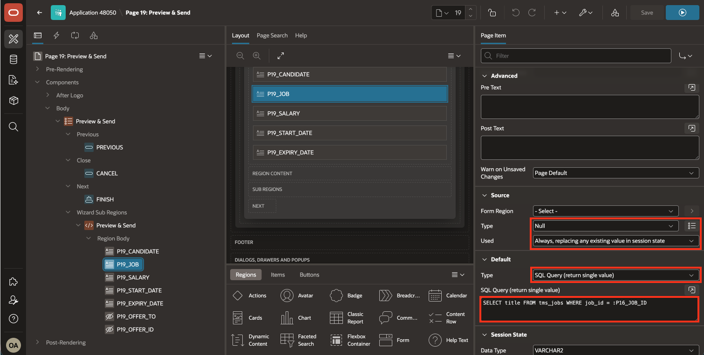

6. Update the **Source** for following page items as follow:

    | Page Item | Type | Item | Used |
    | -- | --- | --- | --- |
    | `P19_SALARY` | Item | `P16_SALARY` | Always, replacing any existing value in session state |
    | `P19_START_DATE` | Item | `P16_START_DATE` | Always, replacing any existing value in session state |
    | `P19_EXPIRY_DATE` | Item | `P16_EXPIRY_DATE` | Always, replacing any existing value in session state |

    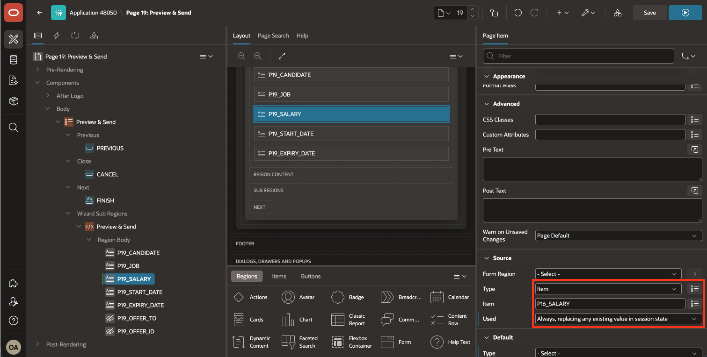

7. Select `P19_OFFER_TO` page item and enter the following:

    - Under Default:

        - Type:  **SQL Query (return single value)**

        - SQL Query (return single value: Copy and paste the following code:

        ```
        <copy>
        SELECT email
        FROM tms_candidates
        WHERE candidate_id = :P16_CANDIDATE_ID;
        </copy>
        ```

    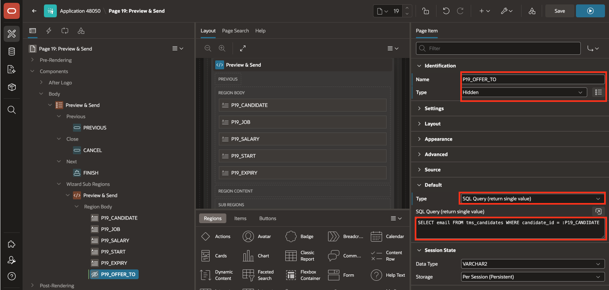

## Task 5: Create Offer Processing

The final processing step reads the staged collection row, creates the offer, and deletes the collection.

1. Navigate **Processing** tab, right-click **Processing** and select **Create Process**.

    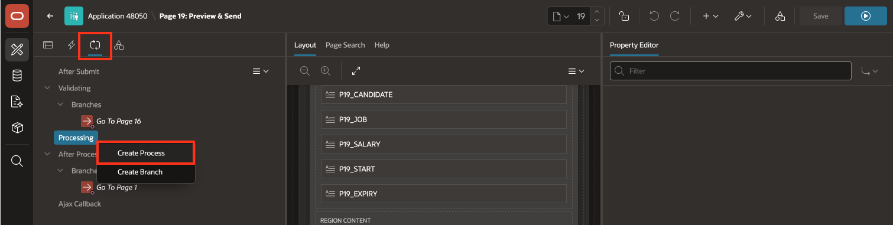

2. In the Property Editor, enter/select the following:

    - Identification > Name: **Create Offer**

    - Source > PL/SQL Code: Copy and paste the following code:

    ```
    <copy>
    DECLARE
    l_cand_id NUMBER;
    l_job_id  NUMBER;
    l_req_id  NUMBER;
    l_salary  NUMBER;
    l_start   DATE;
    l_expiry  DATE;
    BEGIN
    SELECT TO_NUMBER(c001),
           TO_NUMBER(c002),
           n001,
           d001,
           d002
    INTO   l_cand_id,
           l_job_id,
           l_salary,
           l_start,
           l_expiry
    FROM apex_collections
    WHERE collection_name = 'OFFER_COLLECTION'
      AND seq_id = 1;

    SELECT req_id
    INTO   l_req_id
    FROM   tms_job_requisitions
    WHERE  job_id = l_job_id
    AND    status = 'Open'
    AND    ROWNUM = 1;

    INSERT INTO tms_offers (
        candidate_id,
        req_id,
        offered_salary,
        start_date,
        expiry_date,
        status
    )
    VALUES (
        l_cand_id,
        l_req_id,
        l_salary,
        l_start,
        l_expiry,
        'Sent'
    )
    RETURNING offer_id INTO :P19_OFFER_ID;

    apex_collection.delete_collection('OFFER_COLLECTION');
    END;
    </copy>
    ```

    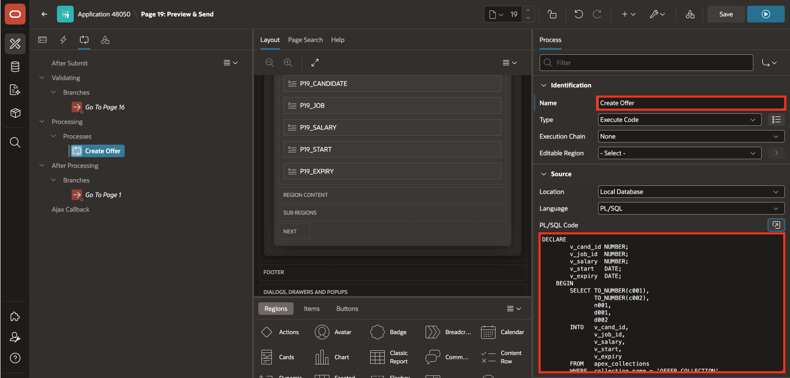

3. Create another process. Right-click **processing** and select **Create Process**.

    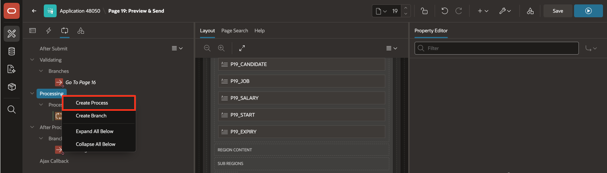

4. In the Property Editor, enter/select the following:

    - Under Identification:

        - Name: **Send Offer Email**

        - Type: **Send E-Mail**

    - Email Header > To: **&P19\_OFFER\_TO.**

    - Under Email Template:

        - Email Template: **Offer Sent**

        - Placeholder Values: Click **5 placeholders, 0 assigned.**

            - Assign Items or Values:

            | Placeholder | Item or Value |
            | --- | --- |
            | JOB_TITLE | &P19_JOB. |
            | CANDIDATE_NAME | &P19_CANDIDATE. |
            | OFFERED_SALARY | &P19_SALARY. |
            | START_DATE | &P19\_START\_DATE. |
            | EXPIRY_DATE | &P19\_EXPIRY\_DATE. |

            - Click **OK**.

    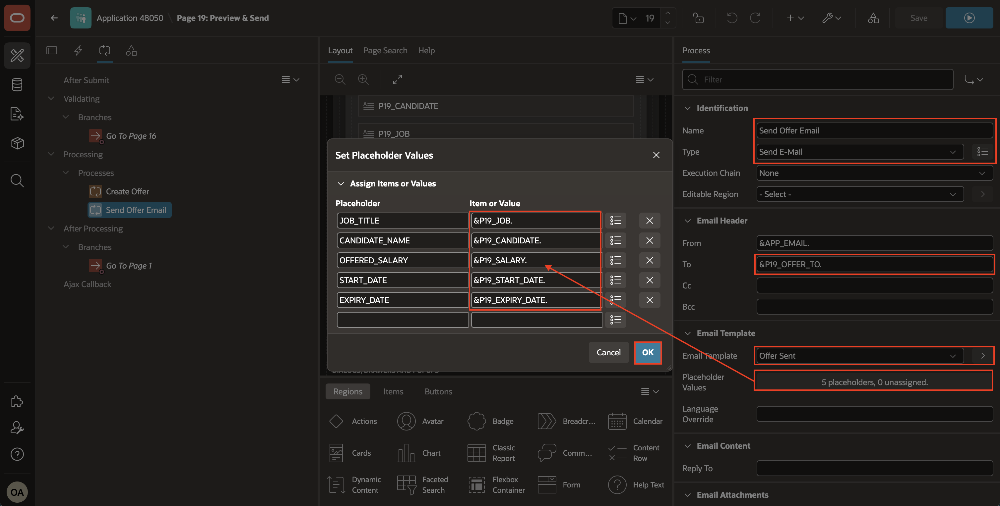

5. Add the same cancel cleanup logic from Task 3 to this wizard step.

6. Click **Save and Run**.

## Task 6: Test the Offer Wizard

Test both the finish path and the cancel path.

1. Run the Offer Wizard.

    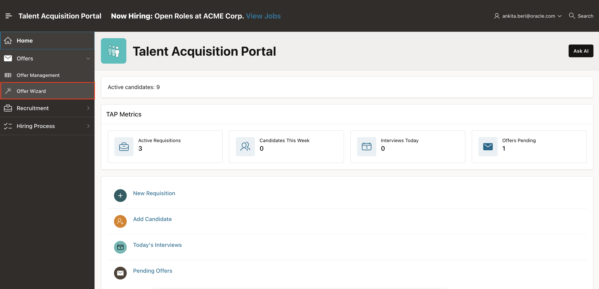

2. Enter offer data on the first step.

    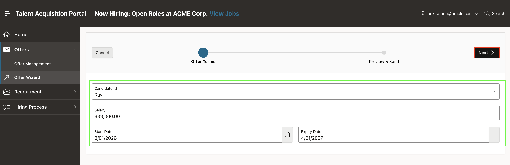

3. Click **Next**.

4. Review the offer on the second step.

    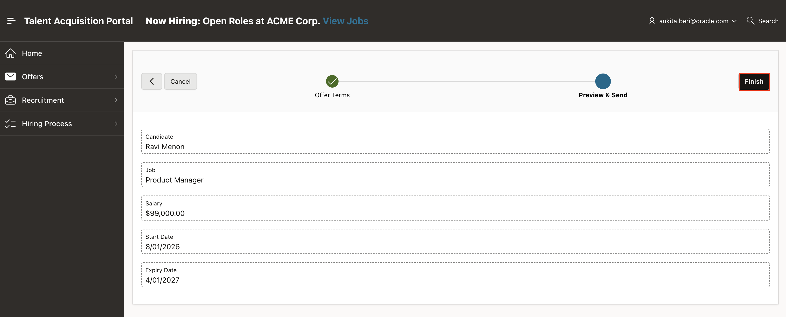

5. Click **Finish**.

6. Confirm that:

    - A row exists in `TMS_OFFERS`.
    - The email appears in `APEX_MAIL_LOG`.
    - `OFFER_COLLECTION` no longer exists.

7. Run the wizard again and click **Cancel** on each step.

8. Confirm that no offer row is inserted and the collection is removed.

## Summary

You created a two-step Offer Wizard in the Talent Acquisition Portal. The wizard stages offer terms in an APEX Collection, previews the staged offer, creates the final offer row, sends an email, and clears the collection when the user finishes or cancels.

## Acknowledgements

**Author** - Ankita Beri, Senior Product Manager; Roopesh Thokala, Principal Product Manager

**Last Updated By/Date** - Ankita Beri, August 12, 2026
