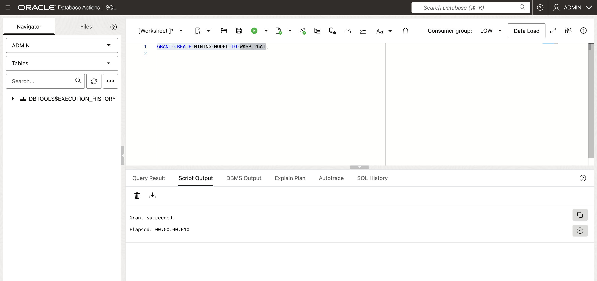
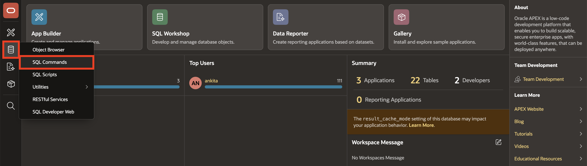
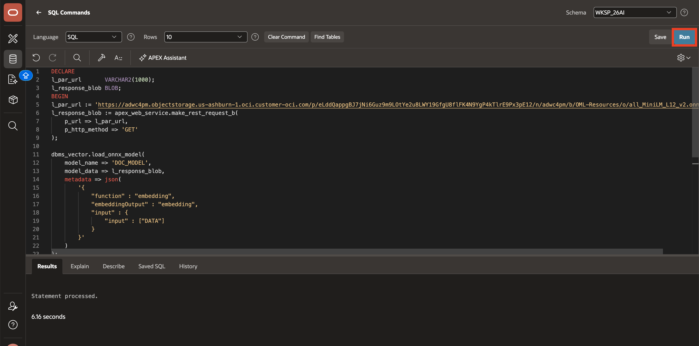
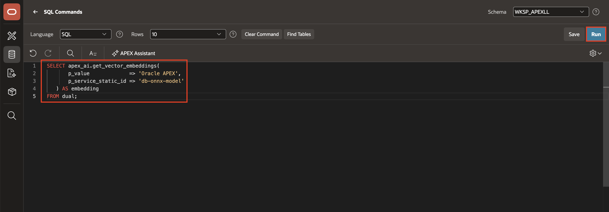
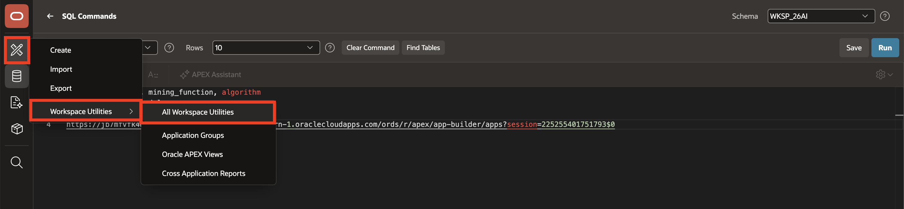
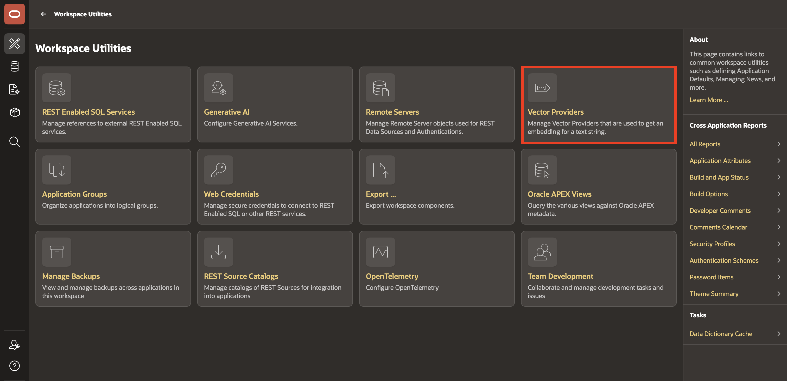
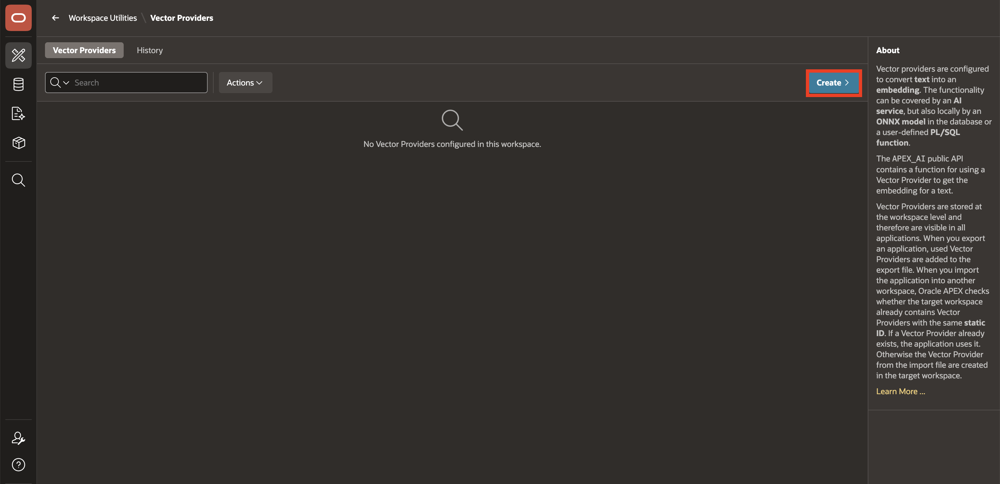
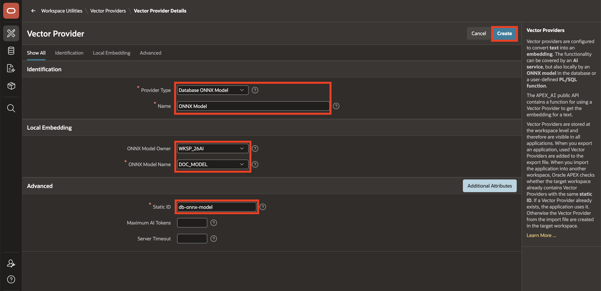
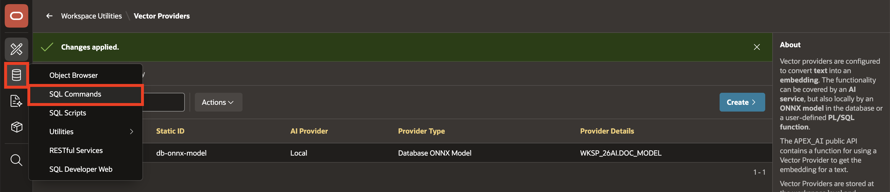
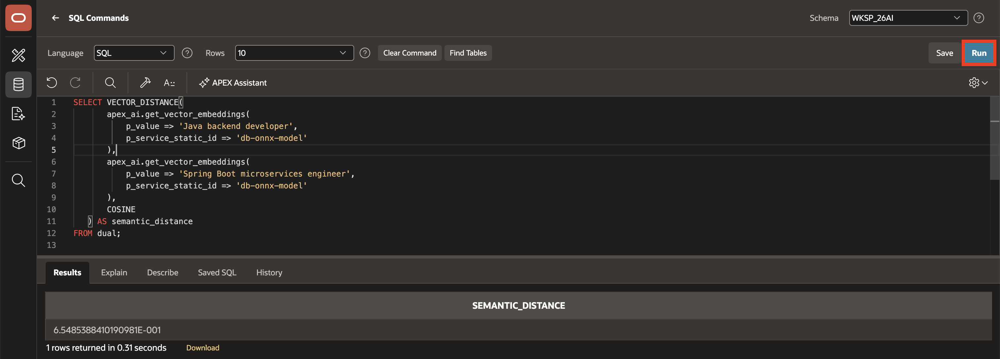

# Lab 1: Search Configuration and Vector Providers

## Introduction

This lab prepares the environment for semantic search by granting the required database privilege, loading the ONNX embedding model, and creating the APEX vector provider. You will validate the model and vector functions before creating any application-specific search logic.

Estimated Lab Time: 10 minutes

### Objectives

In this lab, you will:

- Grant the required database privilege for model creation
- Load the ONNX embedding model into the database
- Create the APEX vector provider
- Validate vector embeddings and semantic distance functions

## Task 1: Grant Database Privileges

To enable your schema to load the mining models, you must grant the necessary privileges while logged in as a SYS or Admin user in SQL Actions.

1. Login as SYS/Admin User and execute the below command.

    ```
    <copy>
    GRANT EXECUTE ON DBMS_CLOUD TO <YourSchemaName> ;
    GRANT CREATE MINING MODEL TO <YourSchemaName>;
    </copy>
    ```

    This privilege allows the APEX parsing schema to load the ONNX embedding model used for semantic search.

    

## Task 2: Load ONNX Model to Oracle Database

In this lab, you will load the ONNX Models into your database.

1. Log in to your Oracle APEX workspace.

2. From your Application homepage, navigate to **SQL Workshop** > **SQL Commands**.

    

3. Copy and paste the below code to load the model and click **Run**.

    ```
    <copy>
    DECLARE
    l_par_url       VARCHAR2(1000);
    l_response_blob BLOB;
    BEGIN
    l_par_url := 'https://adwc4pm.objectstorage.us-ashburn-1.oci.customer-oci.com/p/eLddQappgBJ7jNi6Guz9m9LOtYe2u8LWY19GfgU8flFK4N9YgP4kTlrE9Px3pE12/n/adwc4pm/b/OML-Resources/o/all_MiniLM_L12_v2.onnx';
    l_response_blob := apex_web_service.make_rest_request_b(
        p_url => l_par_url,
        p_http_method => 'GET'
    );

    dbms_vector.load_onnx_model(
        model_name => 'DOC_MODEL',
        model_data => l_response_blob,
        metadata => json(
            '{
                "function" : "embedding",
                "embeddingOutput" : "embedding",
                "input" : {
                    "input" : ["DATA"]
                }
            }'
        )
    );
    END;
    </copy>
    ```

    

4. Copy and paste the below code and click **Run** to validate the model registration.

    ```
    <copy>
    SELECT model_name, mining_function, algorithm
    FROM user_mining_models
    WHERE model_name = 'DOC_MODEL';
    </copy>
    ```

5. Confirm that DOC_MODEL is present and that it is classified as an embedding model.

    

## Task 3: Create the Oracle APEX Vector Provider

1. From the left navigation menu, hover on **App Builder** and select **Workspace Utilities**, then **All Workspace Utilities**.

    

2. Select **Vector Providers**.

    

3. Click **Create**.

    

4. Configure the provider with these values:

    - Under Identification:

        - Provider Type: **Database ONNX Model**

        - Name: **ONNX Model**

    - Under Local Embedding:

        - ONXX Model Owner: Select your schema name

        - ONNX Model Name: **DOC_MODEL**

    - Advanced > Static ID: **db-onnx-model**

    

5. Click **Create**.

6. Test the vector provider from SQL Workshop. Navigate to **SQL Workshop** and then **SQL Commands**.

    

7. **Run** the following query and verify that a VECTOR value is returned.

    ```
    <copy>
    SELECT apex_ai.get_vector_embeddings(
           p_value             => 'Oracle APEX',
           p_service_static_id => 'db-onnx-model'
       ) AS embedding
    FROM dual;
    </copy>
    ```

    

8. Now, test semantic distance. **Run** the following query:

    ```
    <copy>
    SELECT VECTOR_DISTANCE(
           apex_ai.get_vector_embeddings(
               p_value => 'Java backend developer',
               p_service_static_id => 'db-onnx-model'
           ),
           apex_ai.get_vector_embeddings(
               p_value => 'Spring Boot microservices engineer',
               p_service_static_id => 'db-onnx-model'
           ),
           COSINE
       ) AS semantic_distance
    FROM dual;
    </copy>
    ```

    

    *Note: Verify that the query returns a numeric value. Do not introduce a fixed cutoff for this lab because the distance depends on the model and data used in later searches.*

## Summary

This lab prepares the foundation for semantic search. The database contains the embedding model, the APEX vector provider is available, and the vector functions are returning usable semantic results.

## Acknowledgements

- **Author** - Ankita Beri, Senior Product Manager
- **Last Updated By/Date** - Ankita Beri, August 2026
