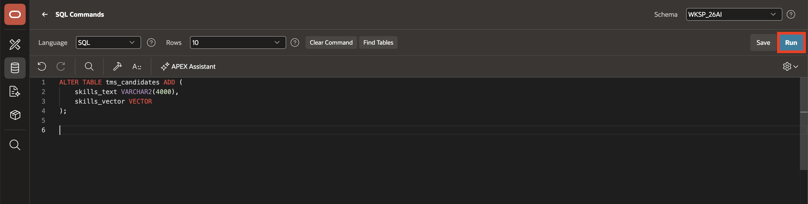
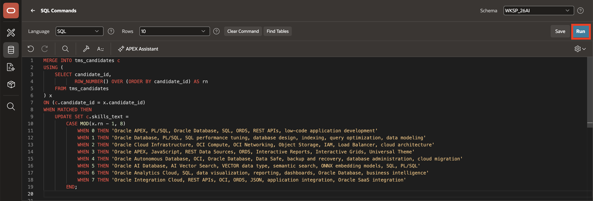
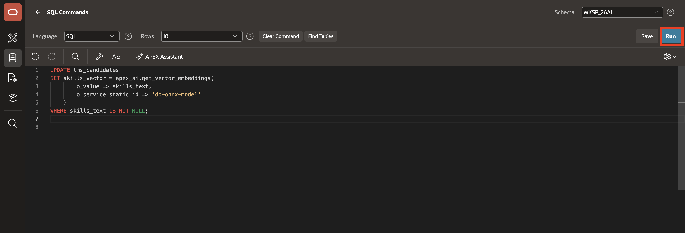
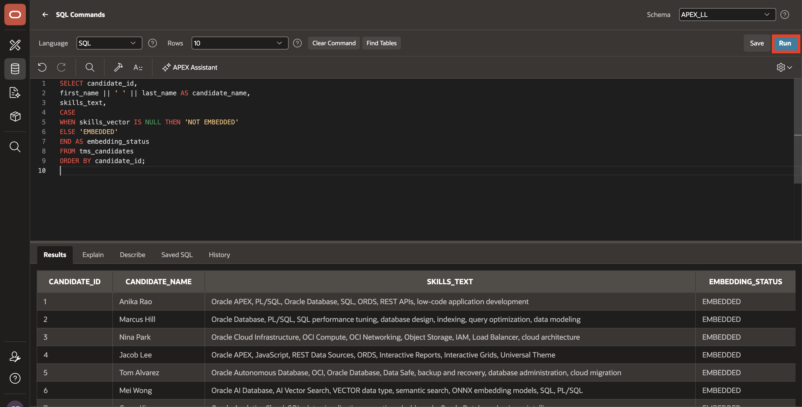
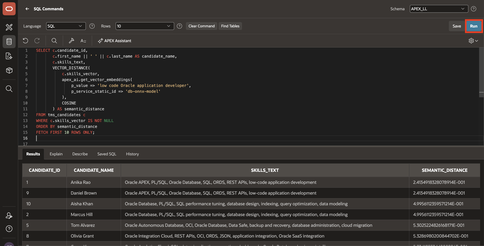
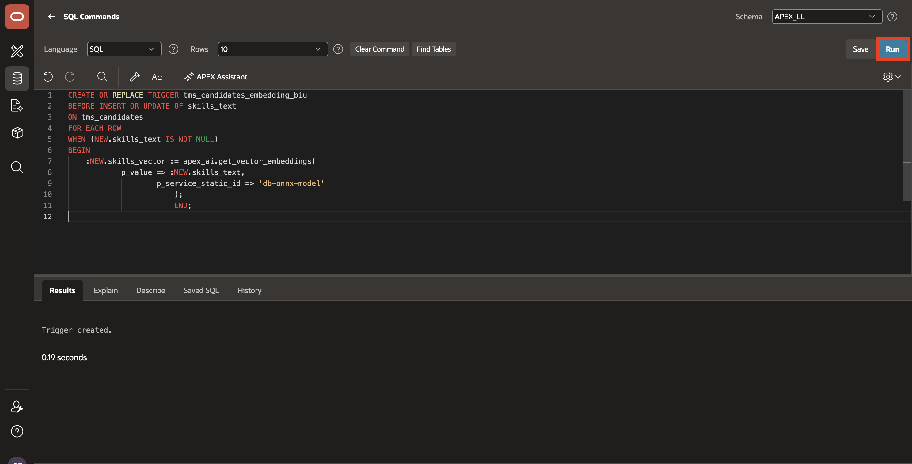

# Lab 2: Enable Vector Embeddings on the Candidates Table

## Introduction

This lab adds the text and vector columns required for semantic matching on candidate records. After populating sample Oracle-focused skills, you will generate embeddings and validate the semantic ranking behavior against natural-language candidate search prompts.

Estimated Lab Time: 10 minutes

### Objectives

In this lab, you will:

- Add a semantic search text field and vector column to the candidate table.

- Populate the candidate skills text with realistic Oracle roles and capabilities.

- Generate vector embeddings with the APEX vector provider.

- Verify the semantic search ranking before using it in APEX.

## Task 1: Add the semantic search columns

1. **Run** the following SQL to create the columns.

    ```
    <copy>
        ALTER TABLE tms_candidates ADD (
        skills_text VARCHAR2(4000),
        skills_vector VECTOR
    );
    </copy>
    ```

    

2. To populate sample Oracle-focused skills. **Run** the following SQL to assign a realistic skill description for each candidate:

    ```
    <copy>
    MERGE INTO tms_candidates c
    USING (
        SELECT candidate_id,
               ROW_NUMBER() OVER (ORDER BY candidate_id) AS rn
        FROM tms_candidates
    ) x
    ON (c.candidate_id = x.candidate_id)
    WHEN MATCHED THEN
        UPDATE SET c.skills_text =
            CASE MOD(x.rn - 1, 8)
                WHEN 0 THEN 'Oracle APEX, PL/SQL, Oracle Database, SQL, ORDS, REST APIs, low-code application development'
                WHEN 1 THEN 'Oracle Database, PL/SQL, SQL performance tuning, database design, indexing, query optimization, data modeling'
                WHEN 2 THEN 'Oracle Cloud Infrastructure, OCI Compute, OCI Networking, Object Storage, IAM, Load Balancer, cloud architecture'
                WHEN 3 THEN 'Oracle APEX, JavaScript, REST Data Sources, ORDS, Interactive Reports, Interactive Grids, Universal Theme'
                WHEN 4 THEN 'Oracle Autonomous Database, OCI, Oracle Database, Data Safe, backup and recovery, database administration, cloud migration'
                WHEN 5 THEN 'Oracle AI Database, AI Vector Search, VECTOR data type, semantic search, ONNX embedding models, SQL, PL/SQL'
                WHEN 6 THEN 'Oracle Analytics Cloud, SQL, data visualization, reporting, dashboards, Oracle Database, business intelligence'
                WHEN 7 THEN 'Oracle Integration Cloud, REST APIs, OCI, ORDS, JSON, application integration, Oracle SaaS integration'
    END;
            </copy>
    ```

    

## Task 2: Generate and verify candidate embeddings

1. To generate the vector embeddings use the vector provider created in Lab 1 and **rRun** the following SQL Query::

    ```
    <copy>
    UPDATE tms_candidates
    SET skills_vector = apex_ai.get_vector_embeddings(
            p_value => skills_text,
            p_service_static_id => 'db-onnx-model'
        )
    WHERE skills_text IS NOT NULL;
    </copy>
    ```

    

2. To verify the embedding status, **Run** the following query:

    ```
    <copy>
    SELECT candidate_id,
           first_name || ' ' || last_name AS candidate_name,
           skills_text,
           CASE
               WHEN skills_vector IS NULL THEN 'NOT EMBEDDED'
               ELSE 'EMBEDDED'
           END AS embedding_status
    FROM tms_candidates
    ORDER BY candidate_id;
    </copy>
    ```

    *Note:Confirm that the candidate rows with skills text show EMBEDDED.*

    

3. To test semantic ranking, **Run** the below SQL Query:

    ```
    <copy>
    SELECT c.candidate_id,
           c.first_name || ' ' || c.last_name AS candidate_name,
           c.skills_text,
           VECTOR_DISTANCE(
               c.skills_vector,
               apex_ai.get_vector_embeddings(
                   p_value => 'low code Oracle application developer',
                   p_service_static_id => 'db-onnx-model'
               ),
               COSINE
           ) AS semantic_distance
    FROM tms_candidates c
    WHERE c.skills_vector IS NOT NULL
    ORDER BY semantic_distance
    FETCH FIRST 10 ROWS ONLY;
    </copy>
    ```

    *Note:Candidates with Oracle APEX, PL/SQL, ORDS, REST APIs, and low-code development skills should rank higher in the result.* set.

    

## Task 3: Keep Embeddings Synchronized

1. **Run** the following PL/SQL to create the trigger.

    ```
    <copy>
    CREATE OR REPLACE TRIGGER tms_candidates_embedding_biu
    BEFORE INSERT OR UPDATE OF skills_text
    ON tms_candidates
    FOR EACH ROW
    WHEN (NEW.skills_text IS NOT NULL)
    BEGIN
        :NEW.skills_vector := apex_ai.get_vector_embeddings(
            p_value => :NEW.skills_text,
            p_service_static_id => 'db-onnx-model'
        );
    END;
    </copy>
    ```

    *Note: This trigger keeps the vector updated whenever the text description changes so the semantic ranking stays accurate.*

    

## Summary

The candidate data is now prepared for semantic search. Skills text and vector embeddings are populated, the model is producing ranked outputs, and the search layer is ready to be exposed in the APEX application.

## Acknowledgements

- **Author** - Ankita Beri, Senior Product Manager
- **Last Updated By/Date** - Ankita Beri, August 2026
