# Lab 3: Implement Semantic Search on the Candidate Pipeline in TAP

## Introduction

This lab adds semantic search to the Candidate Pipeline in TAP. You will create a vector search configuration, add a search page item, and validate ranking against natural-language skills queries such as low-code Oracle application developer, cloud infrastructure engineer, and AI database developer.

Estimated Lab Time: 10 minutes

### Objectives

In this lab, you will:

- Create an Oracle AI Vector Search configuration for the candidate table.

- Add a semantic search input to the Candidate Pipeline page.

- Connect the search region to the vector source.

- Validate result ranking with natural-language searches.

## Task 1: Create the Vector Search Configuration

1. Open **Talent Acquisition Portal(TAP)** application.

2. From **App Builder** home page and navigate to **Shared Components**.

    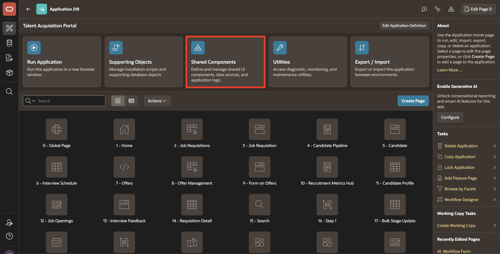

3. Under **Navigation and Search**, select **Search Configurations**.

    

4. Click **Create**.

    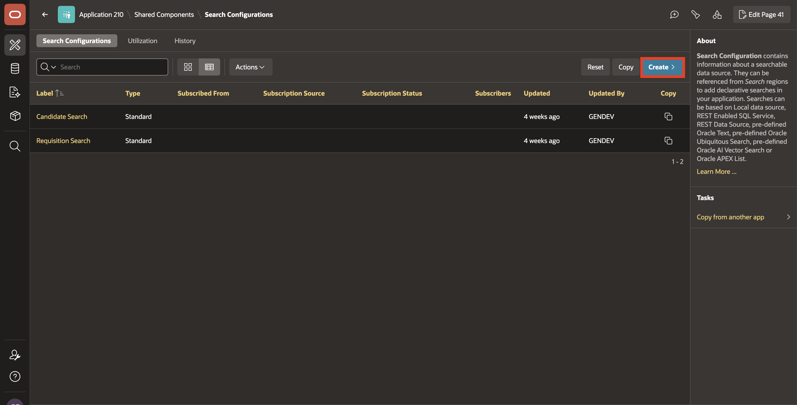

5. Configure the settings as follows:

    - Name: **Candidate Semantic Search**

    - Search Type: **Oracle AI Vector Search**

6. Click **Next**.

    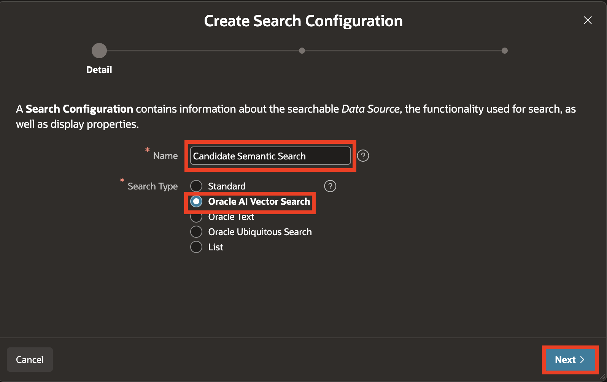

7. Select **DB ONNX Model** as Vector Provider.

8. For Table/View Owner, select **TMS_CANDIDATES** and click **Next**.

    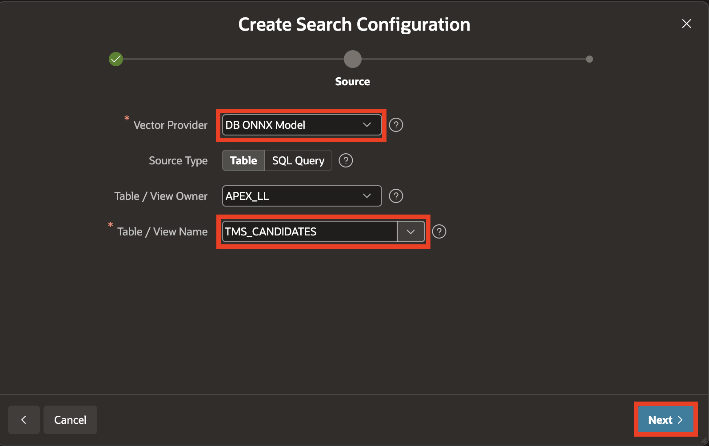

9. For Column Mapping, enter/select the following:

    - Primary Key: **CANDIDATE_ID (Number)**

    - Vector Column: **SKILLS_VECTOR (Vector)**

    - Title Column: **FIRST_NAME (Varchar2)**

    - Description Column: **SKILLS_TEXT (Varchar2)**

10. Click **Create Search Configuration**

    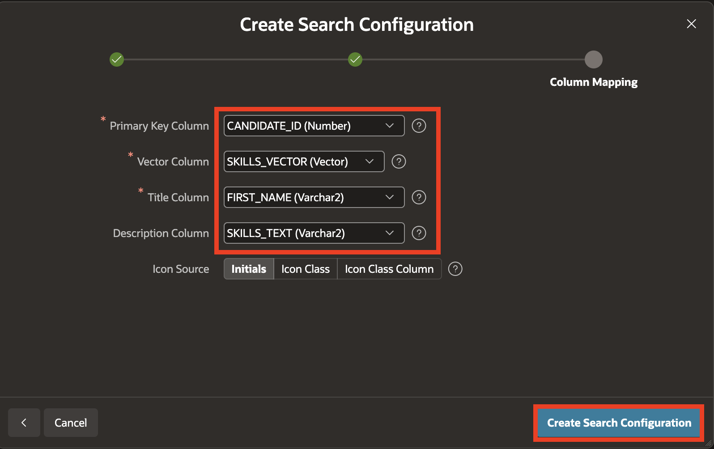

## Task 2: Add the search item and region on the Candidate Pipeline page

1. Navigate to your **Application ID**.

    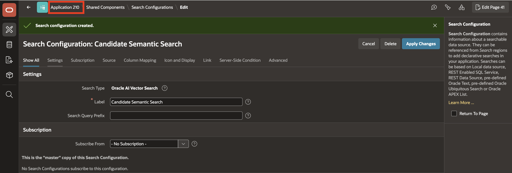

2. Select **4: Candidate Pipeline** page.

    

3. Right-click **Body** and select **Create Page Item**.

4. Drag the page item above **P4\_REQ_ID** page item. In the Property Editor, enter/select the following:

    - Under Identification:

        - Name: **P4\_SEMANTIC\_SEARCH**

        - Type: **Text Field**

    - Label > Label: **Search Candidates**

    - Appearance > Value Placeholder: **Search candidates by skills or experience...**

    

5. Now, right-click on **Body** and select **Create Region**. Drag it below P4\_SEMANTIC\_SEARCH page item.

6. In the Property Editor, enter/select the following:

    - Under Identification:

        - Name: **Semantic Candidate Search**

        - Type: **Search**

    

7. In the Property Editor, select **Attributes** tab and enter/select the following:

    - Under Settings:

        - Search Page Item: **P4\_SEMANTIC\_SEARCH**

        - Search as You Type: **Toggle On**

        - Minimum Characters: **3**

    

8. Under the **Semantic Candidate Search** region, select **Search Sources** and configure it with the following:

    - Under Identification:

        - Name: **Candidate Semantic Search**

        - Search Configuration: **Candidate Semantic Search**

9. Click **Save and Run**.

    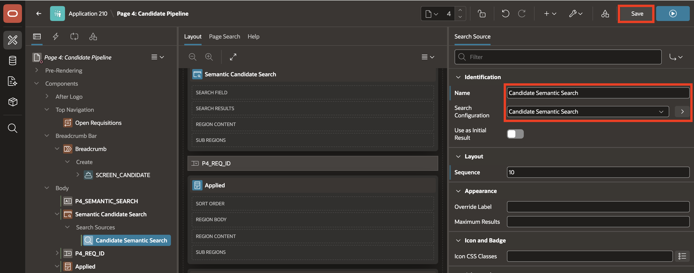

    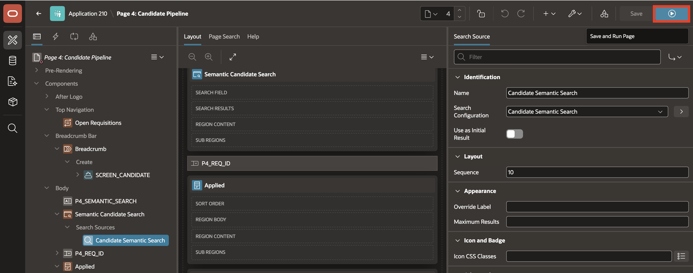

## Task 3: Test Semantic Candidate Ranking

1. Open the **Candidate Pipeline** in **TAP** and enter the following search text in the Search Candidates field:

    ```
    <copy>
    low code Oracle application developer
    </copy>
    ```

    Candidates with skills such as Oracle APEX, PL/SQL, ORDS, REST APIs, and Oracle Database should rank higher in the results.

    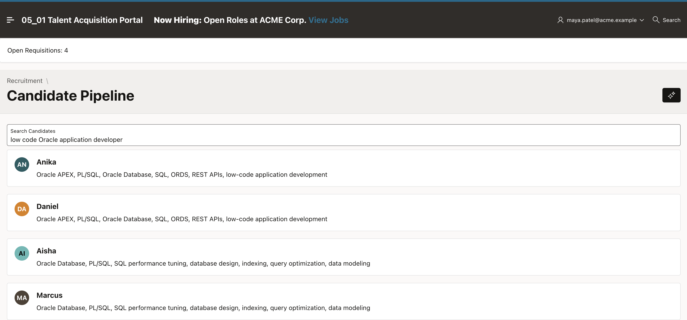

2. Now, let's test an OCI-focused search. Search for:

    ```
    <copy>
    cloud infrastructure engineer
    </copy>
    ```

    Candidates with OCI Compute, OCI Networking, IAM, Object Storage, and cloud architecture experience should rank higher.

    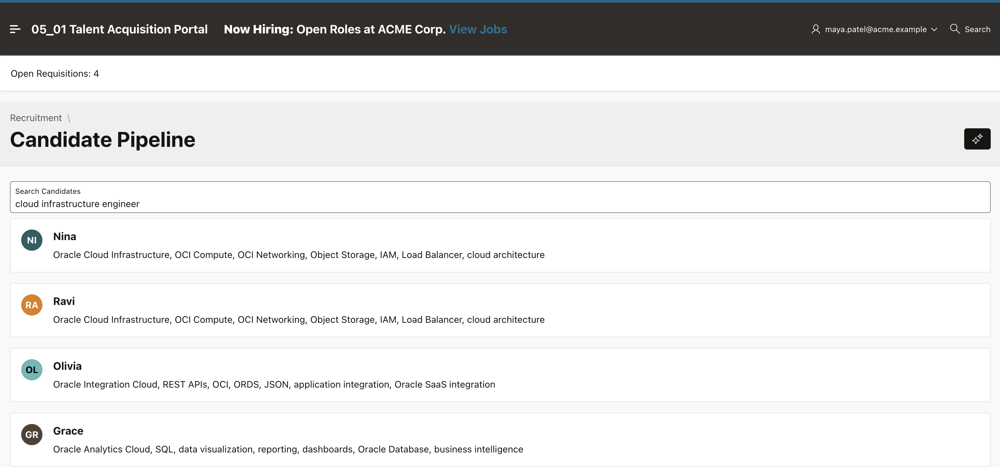

3. Test an AI and vector-focused search. Search for:

    ```
     <copy>
    AI semantic search database developer
     </copy>
    ```

    Candidates with Oracle AI Database, AI Vector Search, VECTOR, ONNX embedding models, SQL, and PL/SQL should rank higher.

    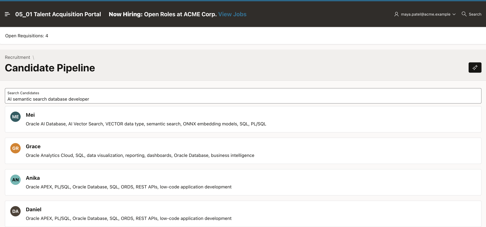

## Summary

The Candidate Pipeline now supports semantic search using the vector embeddings generated from candidate skill descriptions. The ranking aligns with the meaning of the prompt rather than exact word matching alone.

## Acknowledgements

- **Author** - Ankita Beri, Senior Product Manager
- **Last Updated By/Date** - Ankita Beri, August 2026
