# Lab 4: Build the HR Policy Search Page in ESS

## Introduction

This lab prepares the HR policy data for semantic search and then creates a dedicated search page in ESS. You will embed policy content, build the search configuration, and test natural-language prompts such as annual leave policy, benefits information, and employee onboarding requirements.

Estimated Lab Time: 15 minutes

### Objectives

In this lab, you will:

- Generate embeddings for HR policy content.

- Create an Oracle AI Vector Search configuration for policy records.

- Create an HR Policy Search page in ESS.

- Test semantic ranking for policy-related natural-language questions.

## Task 1: Generate HR policy embeddings

1. Navigate back to your APEX workspace.

2. Navigate to **SQL Workshop** and then **SQL Commands**. **Run** the following SQL Query:

    ```
    <copy>
    UPDATE tms_hr_policy
    SET embedding_vector = apex_ai.get_vector_embeddings(
            p_value => title || ' ' || content,
            p_service_static_id => 'db-onnx-model'
        );
    </copy>
    ```

    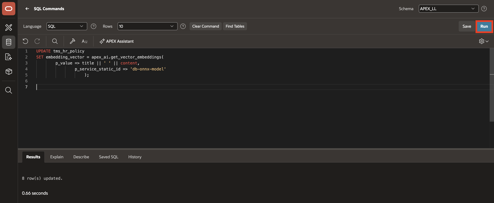

3. To verify the embedding status, **Run** the following SQL Query:

    ```
    <copy>
    SELECT policy_id,
           category,
           title,
           CASE
               WHEN embedding_vector IS NULL THEN 'NOT EMBEDDED'
               ELSE 'EMBEDDED'
           END AS embedding_status
    FROM tms_hr_policy
    ORDER BY category, title;
    </copy>
    ```

    Confirm that the policy rows show EMBEDDED.

    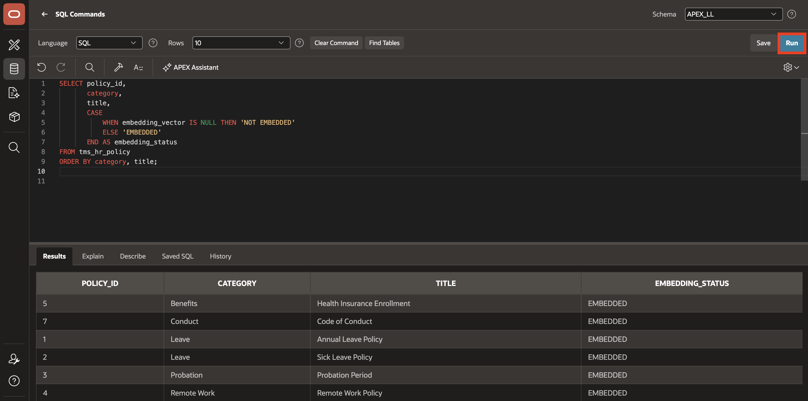

## Task 2: Create the HR Policy Vector Search configuration

1. Open **Employee Self-Service Portal (ESS)** application.

2. Navigate to **Shared Components**.

    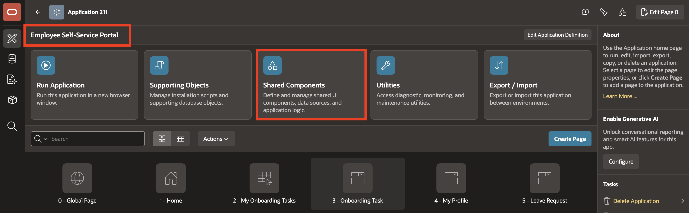

3. Under **Navigation and Search**, select **Search Configurations**.

    

4. Click **Create**.

    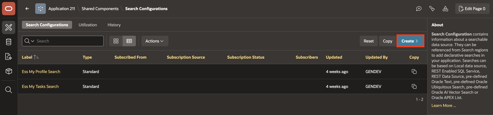

5. Configure the settings as follows:

    - Name: **HR Policy Semantic Search**

    - Search Type: **Oracle AI Vector Search**

6. Click **Next**.

    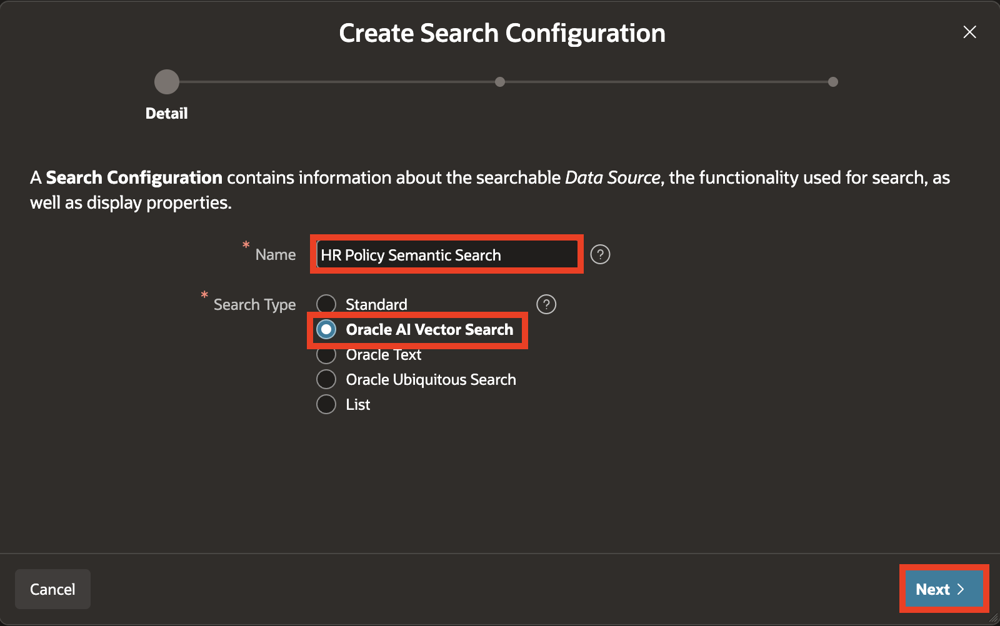

7. Select **DB ONNX Model** as Vector Provider.

8. For Table/View Owner, select **TMS\_HR\_POLICY** and click **Next**.

    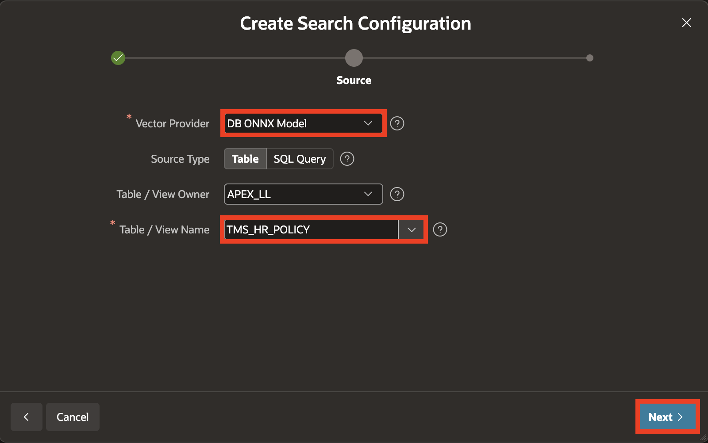

9. For Column Mapping, enter/select the following:

    - Primary Key: **POLICY_ID (Number)**

    - Vector Column: **EMBEDDING_VECTOR (Vector)**

    - Title Column: **TITLE (Varchar2)**

    - Description Column: **CONTENT (Clob)**

10. Click **Create Search Configuration**

    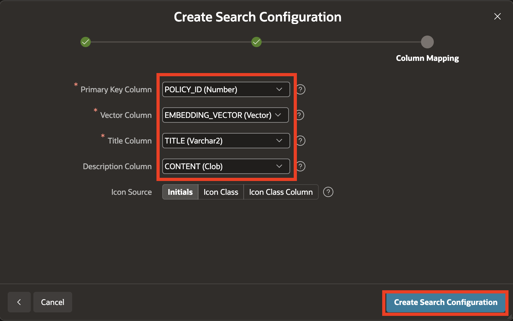

## Task 3: Create the HR Policy Search page

1. Navigate to **Application ID**.

    

2. Click **Create Page**.

    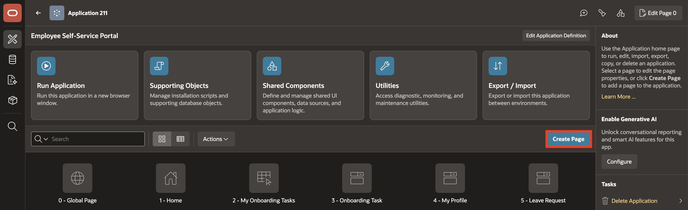

3. Select **Search Page**.

    

4. Configure the following:

    - Name: **HR Policy Search**

    - Search Configurations: Select **HR Policy Semantic Search**

    - Parent Navigation Menu Entry: **HR Info**

5. Click **Create Page**.

    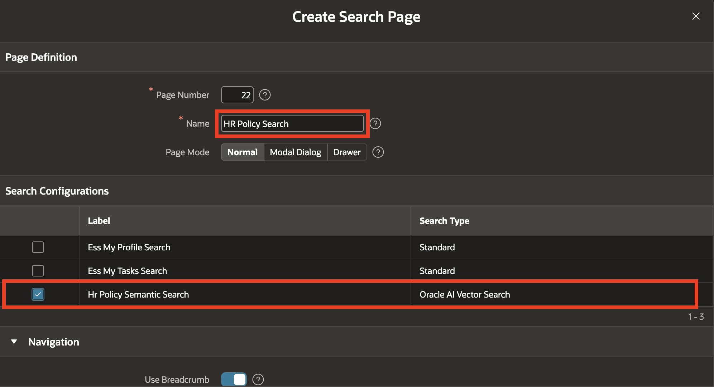

    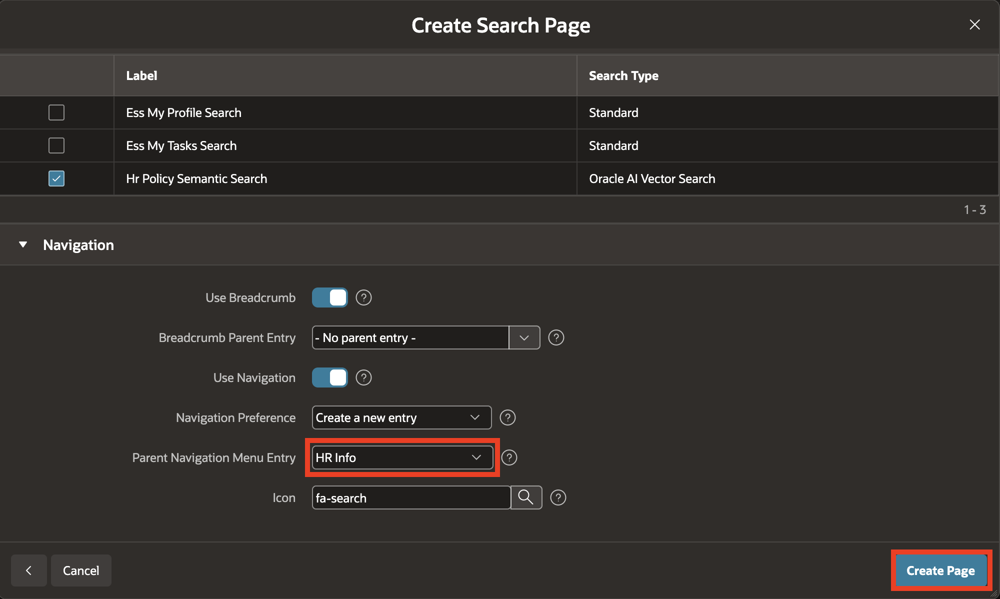

6. Select the **P24_SEARCH** page item. In the Property Editor, update the following:

    - Appearance > Value Placeholder: **Search HR policies by meaning...**

    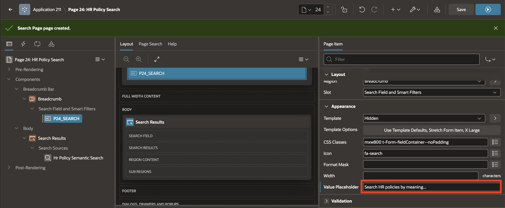

7. Click **Save and Run**.

## Task 4: Validate policy search behavior

1. In HR Policy Search page, search for annual leave.

    Enter:

    ```
    <copy>
    annual leave policy
    </copy>
    ```

    Relevant leave-related policies should rank higher.

    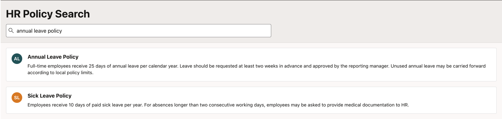

2. Search for benefits information.

    Enter:

    ```
    <copy>
    what benefits are available to employees
    </copy>
    ```

    Relevant benefit-related policies should rank higher.

    

3. Search for onboarding requirements.

    Enter:

    ```
    <copy>
    new employee onboarding requirements
    </copy>
    ```

    Relevant onboarding and employee-policy content should rank higher.

    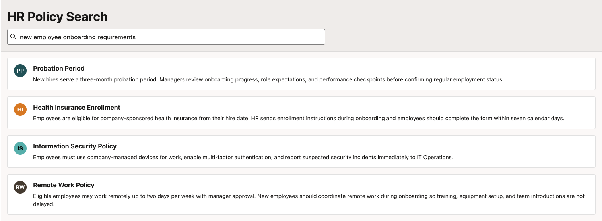

## Summary

The HR policy search page now uses semantic ranking to match user intent across policy titles and content. That makes the search experience more natural and supports downstream AI agent grounding for onboarding and policy questions.

## Acknowledgements

- **Author** - Ankita Beri, Senior Product Manager
- **Last Updated By/Date** - Ankita Beri, August 2026
