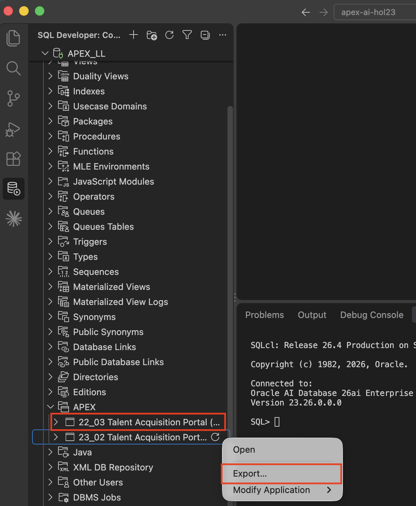
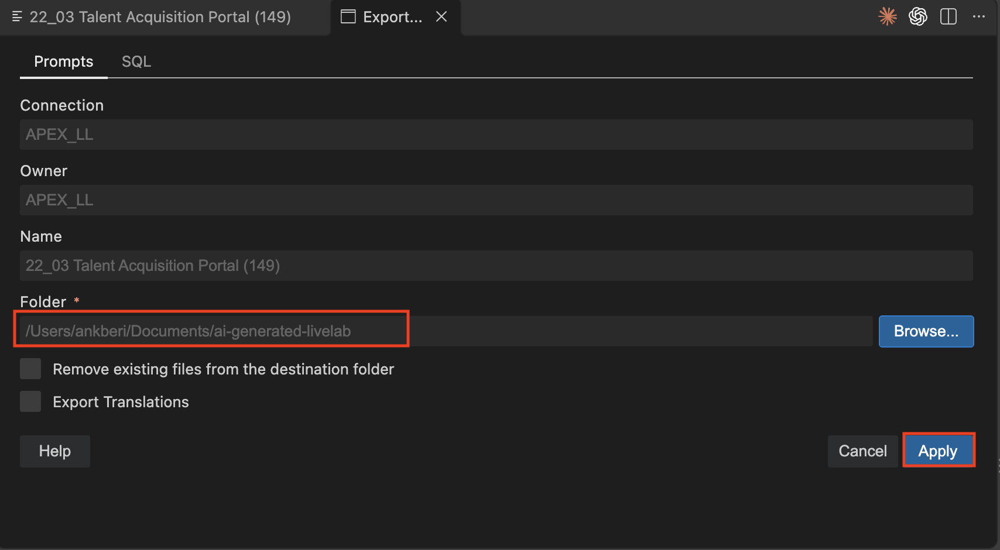
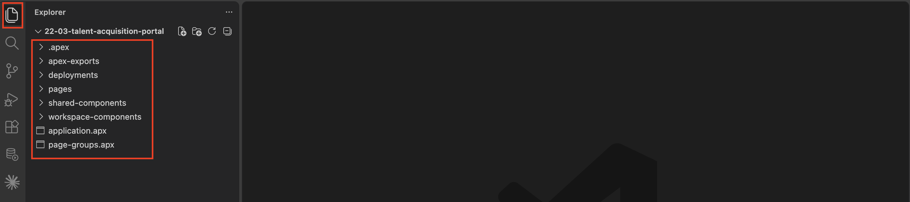
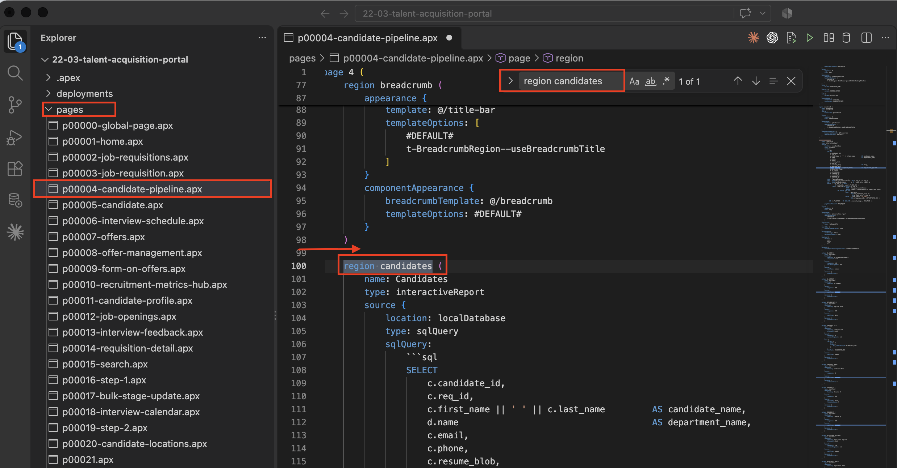
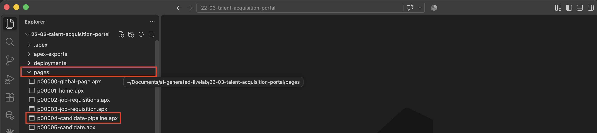
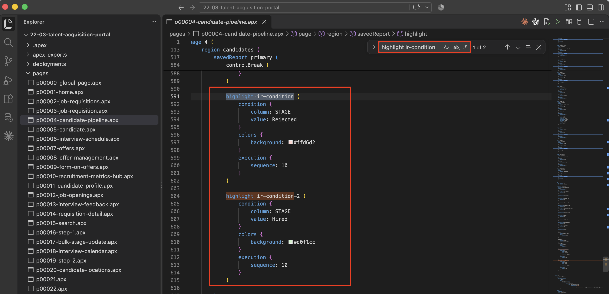

# Export TAP and Review the APEXlang Project

## Introduction

In this lab, you export the TAP application from SQL Developer for VS Code and review the files that describe the application in APEXlang. You will identify the Candidate Pipeline interactive report, its AI Score column, and its existing highlighting configuration.

### Objectives

In this lab, you will:

- Connect to the lab database from VS Code.
- Export TAP to a local APEXlang project.
- Locate Page 4 and review existing APEX components.

Estimated Time: 10 minutes

## Task 1: Export TAP

Export the TAP application to a local project.

1. Navigate to SQL Developer extension, expand the connection you created and further expand APEX.

2. Under APEX, you will find all the apps that are part of the schema. Right-click **Talent Acquisition Portal
application** and select **Export**.

   

3. Accept the default values, for Folder, click **Browse** and select the applications folder. Then, click **Apply**.

    

## Task 2: Review the Project Structure

Open the exported project and review its main folders and files.

1. Open the exported project folder in VS Code.

2. Review these main folders and files:

    - `application.apx`
    - `pages/`
    - `shared-components/`
    - `deployments/`

    

3. In the `pages/` folder, open `p00004-candidate-pipeline.apx`.

    

## Task 3: Review Existing Components

Use search to connect the exported APEXlang entries with familiar APEX components.

You learned about interactive reports (IRs) in an earlier module. In this task, you will see how the Candidate Pipeline report and its components are represented in APEXlang.

1. Use `Ctrl + F`.

2. Search for `region candidates`.

    This is the Candidate Pipeline Interactive Report.

    

3. Search for `column AI_SCORE`.

    This is the AI Score report column.

    

4. Search for `highlight ir-condition`.

    This is the existing Interactive Report highlighting configuration.

    

## Summary

You can now identify familiar APEX components in the exported APEXlang file, including the Candidate Pipeline interactive report, the AI Score column, and the report highlighting configuration.

## Acknowledgements

- **Author** - Ankita Beri, Senior product manager
- **Last Updated By/Date** - Ankita Beri, September, 2026
