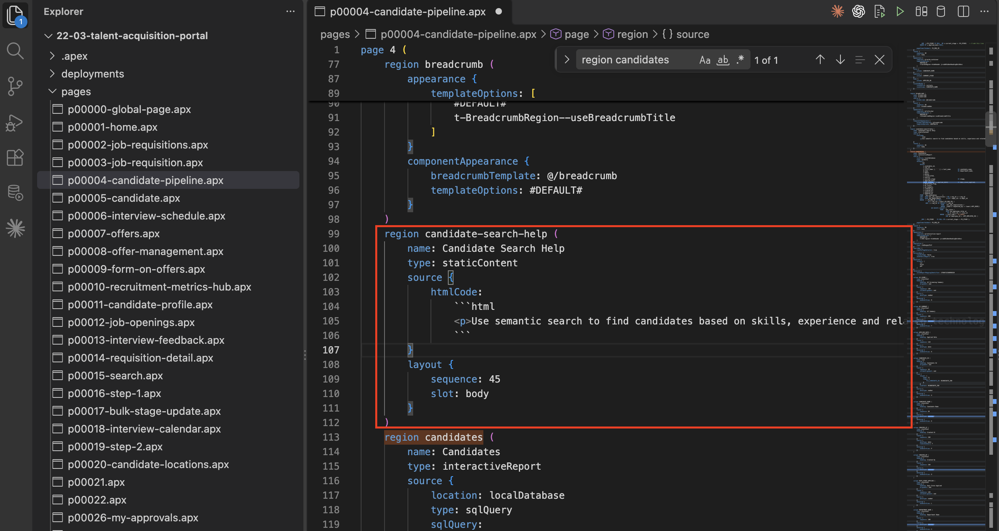
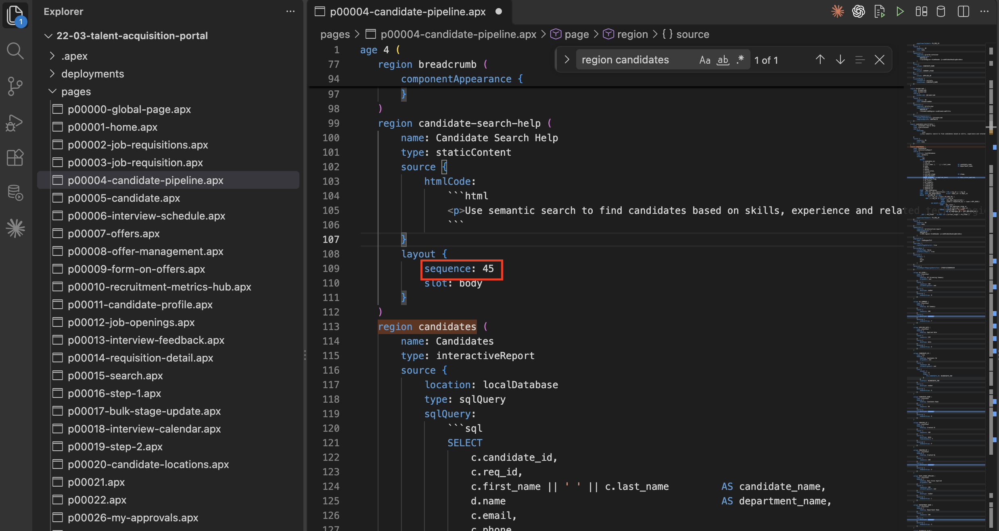
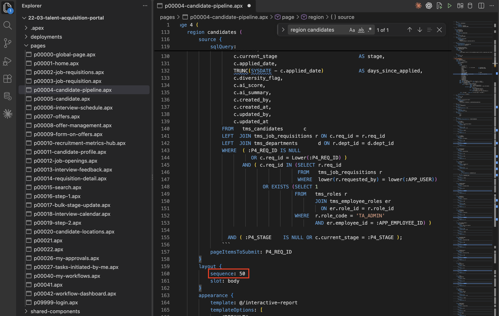
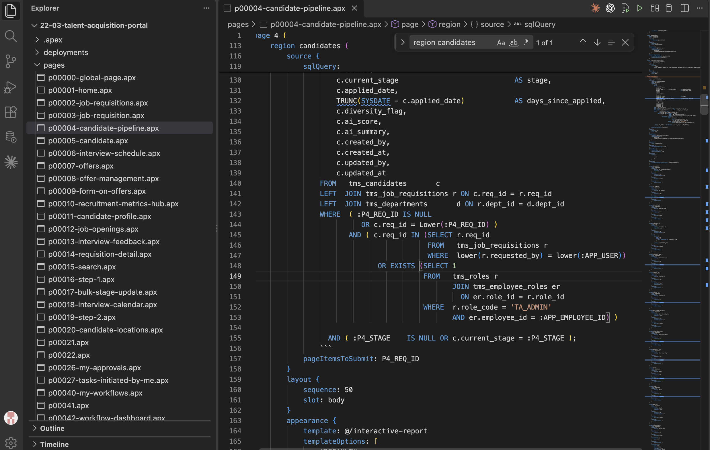
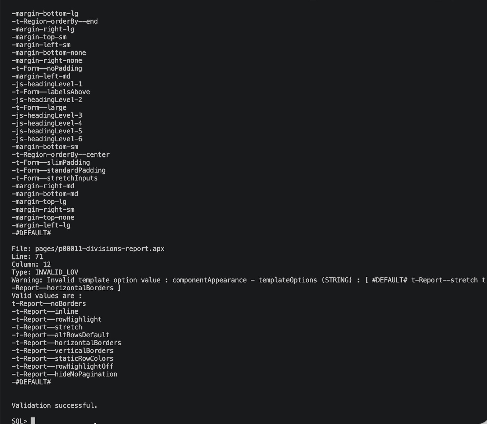

# Add a New Component and Validate the Project

## Introduction

In this lab, you update the Candidate Pipeline APEXlang file by adding a static content region. You then save the file and validate the complete project with the APEX command-line tool.

### Objectives

In this lab, you will:

- Locate the Candidate Pipeline region and its layout sequence.
- Add the Candidate Search Help static content region.
- Save and validate the APEXlang project.

Estimated Time: 10 minutes

## Task 1: Locate the Candidate Pipeline Region

Find the existing Candidate Pipeline region and confirm its layout position.

1. Under *pages*, select `p00004-candidate-pipeline.apx`.

2. Search for `region candidates`.

   

## Task 2: Add a New Static Content Region

Add a help message before the Candidate Pipeline region. The new region uses sequence 45, so it appears before the existing region at sequence 50.

1. Add the following region before `region candidates`:

     ```
    <copy>
    region candidate-search-help (
        name: Candidate Search Help
        type: staticContent
        source {
            htmlCode:
                html
                <p>Use semantic search to find candidates based on skills, experience and related technologies.</p>

        }
        layout {
            sequence: 45
            slot: body
        }
    )
    </copy>
    ```

    

2. Confirm that `sequence: 45` places the new region before the Candidate Pipeline region at `sequence: 50`.

    After import in Lab 3, the region appears in Page Designer as shown here:

    

    

3. Save the APEXlang page file after adding the region.

4. Press **(Command + S)** or **(Ctrl + S)**, to save **`p00004-candidate-pipeline.apx`**.

    

## Task 3: Validate the APEXlang Project

Run validation against the exported project and confirm that the new specification is error-free.

1. Open a terminal.

2. Run the following command:

    ```bash
    <copy>
    apex validate -input 'enter the folder path'
    </copy>
    ```

3. Wait for validation to complete.

4. Verify that no APEXlang validation errors are reported.

     

## Summary

The APEXlang project now contains the Candidate Search Help region and validates successfully.

## Acknowledgements

- **Author** - Ankita Beri, Senior product manager

- **Last Updated By/Date** - Ankita Beri, September, 2026
