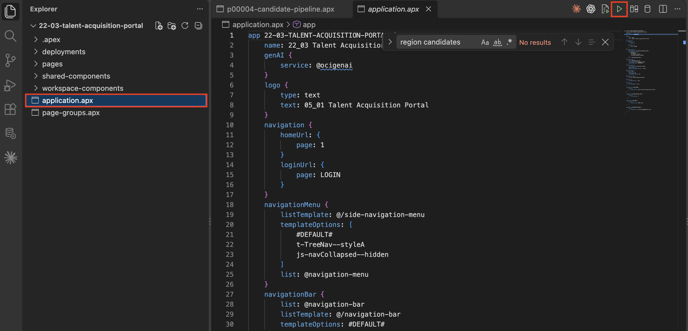
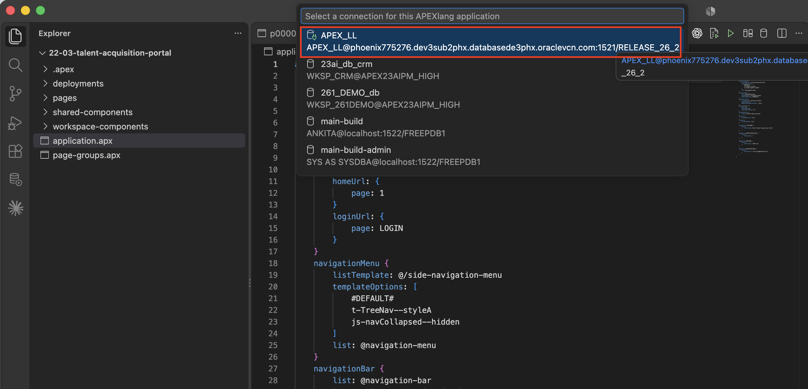
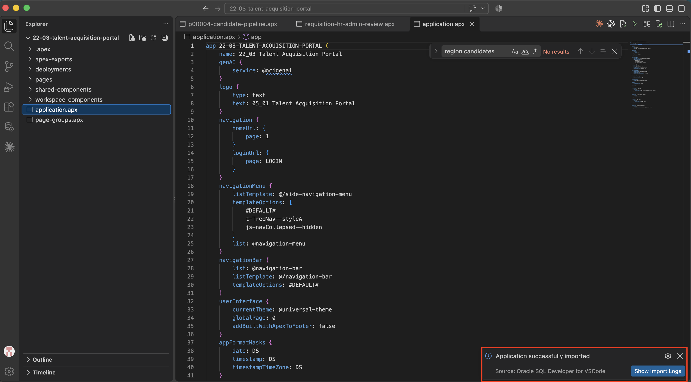
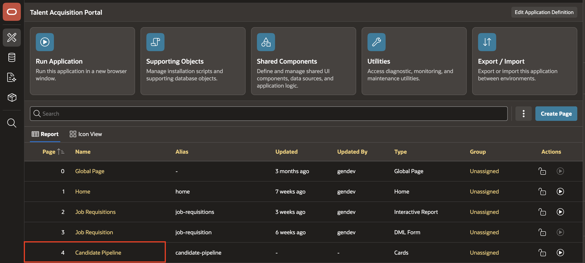
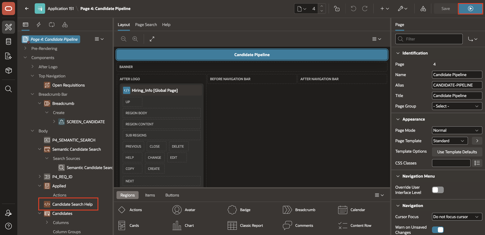
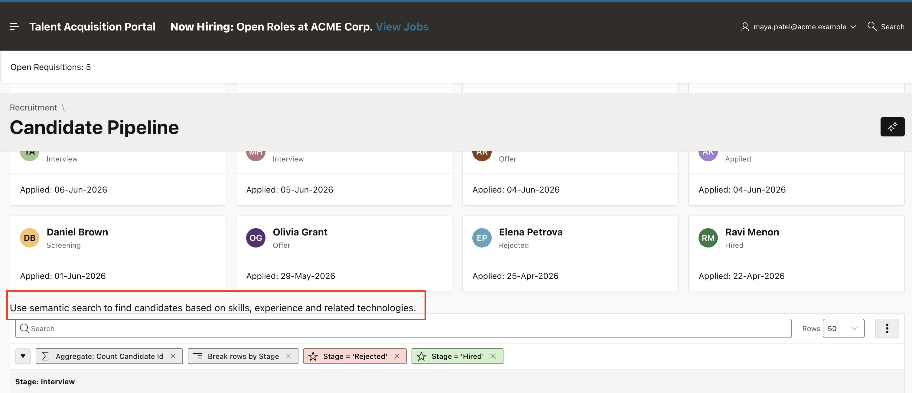

# Import TAP and Verify the Change

## Introduction

In this lab, you import the updated TAP application from the APEXlang project and verify the new region in Page Designer and at runtime.

### Objectives

In this lab, you will:

- Import the updated TAP application in SQL Developer for VS Code.
- Verify the Candidate Search Help region in Page Designer.
- Verify the region and its message when you run the Candidate Pipeline page.

Estimated Time: 5 minutes

## Task 1: Import the Application

Import the updated application into the lab database.

1. In Oracle SQL Developer for VS Code, open `application.apx`.

    

2. Attach the database connection if required and click `Import`.

    

3. Save all files if prompted.

4. Wait for the import to complete successfully.

    

## Task 2: Verify in Page Designer

Confirm that the imported region appears in the APEX application.

1. Open `APEX → App Builder → TAP → Page 4 — Candidate Pipeline → Page Designer`.

    

2. Verify that the new region `Candidate Search Help` exists.

    

## Task 3: Verify at Runtime

Run the Candidate Pipeline page and confirm that the new static content is visible.

1. Run `TAP → Candidate Pipeline`.

    

2. Verify that the page displays `Candidate Search Help`.

3. Verify that the page displays the following text:

    `Use semantic search to find candidates based on skills, experience and related technologies.`

    

## Summary

The APEXlang change has been imported successfully and appears in the TAP application in Page Designer and at runtime.

## Acknowledgements

* **Author** - Ankita Beri, Senior product manager
* **Last Updated By/Date** - Ankita Beri, September, 2026
