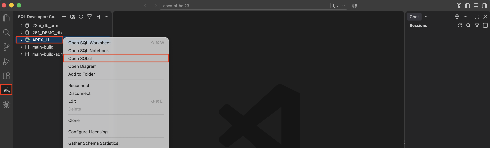
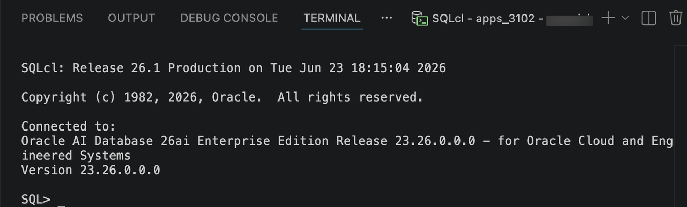
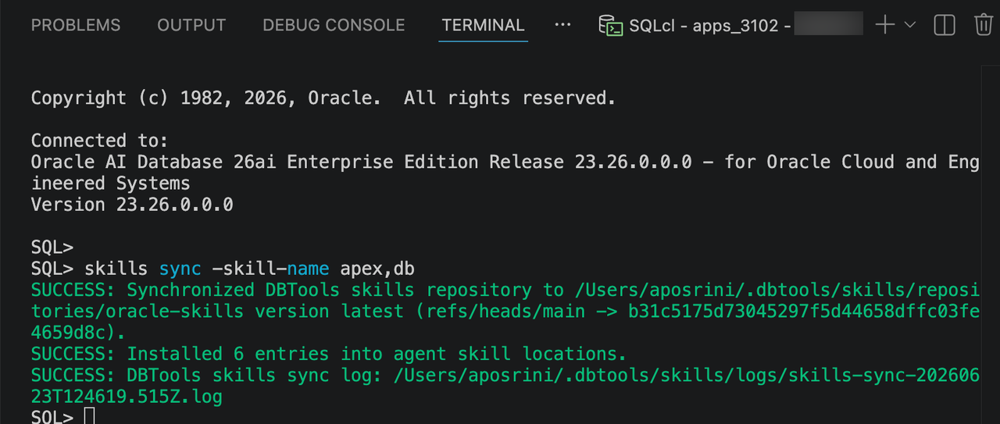

# Set up the APEXlang Skills repo

## Introduction

APEXlang is an Open Application Specification Language introduced in Oracle APEX 26.1. In this lab, you will set up APEXlang skills.

### Objectives

- Configure the APEXlang skills repository in Visual Studio Code.

Estimated Time: 5 minutes

### Downloads

## Task 1: Set up the APEXlang Skills repo in Visual Studio Code

To install the required Oracle APEX and database skills:

1. Open SQL Developer. Right-click your database connection. Select **Open SQLcl**.

    

2. This opens an SQLcl terminal connected to your database schema.

    

3. Run the below command to install the required skills:

    ```
    <copy>
    skills sync -skill-name apex,db
    </copy>
    ```

    

    **Note:** *The Skills repository is updated regularly. To get the latest changes, simply re-run the same command to sync it again.*

    This command installs the Oracle APEX and database-related skills needed for APEXlang workflows.

    After installation, the required skills should be available locally in your coding agent’s skills directory.

    You are now ready to start building APEX applications with APEXlang in your preferred AI coding agent.

    Our skills are publically available at [https://github.com/oracle/skills](https://github.com/oracle/skills).  More advanced users may clone, fork or download them from there and install in their local agents.

## Acknowledgements

- **Author** - Ankita Beri, Senior product manager

- **Last Updated By/Date** - Ankita Beri, September, 2026
