# Create Talent Acquisition Portal (TAP) using the Create App Wizard

## Introduction

In this lab, you will use the APEX Create App Wizard to build a starter Talent Acquisition Portal (TAP). You will add report pages for job requisitions and candidates, along with blank pages reserved for interview scheduling and offers, then run the application to confirm that its pages are available.

Estimated time: 5 minutes

### Objectives

In this lab, you will:

- Create Talent Acquisition Portal (TAP) using the Create App Wizard.

### What You Will Build

- **Talent Acquisition Portal (TAP)**: Created with the Create App Wizard. It includes Home, Job Requisitions, Candidate Pipeline, Interview Schedule, and Offers pages.

## Task 1: Create the Talent Acquisition Portal Application using the Create App Wizard

In this task, you create the Talent Acquisition Portal application using the Create App Wizard. This application becomes the main recruiting workspace for job requisitions, candidates, interviews, and offers.

1. On the Workspace home page, click **App Builder**.

    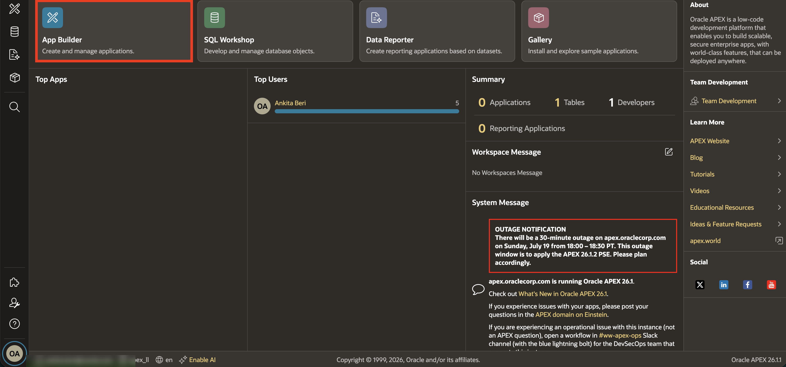

2. Click **Create**.

    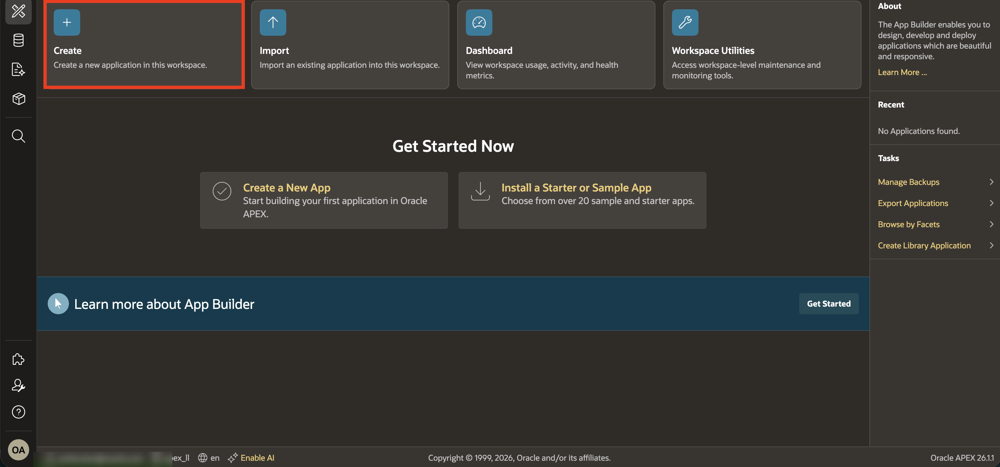

3. Click **Use Create App Wizard**.

    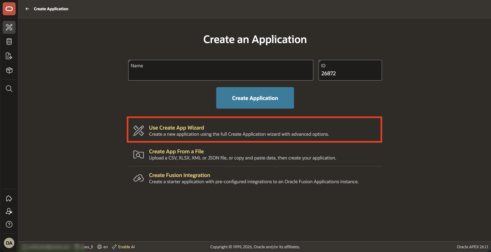

4. For **Name**, enter: **Talent Acquisition Portal**

    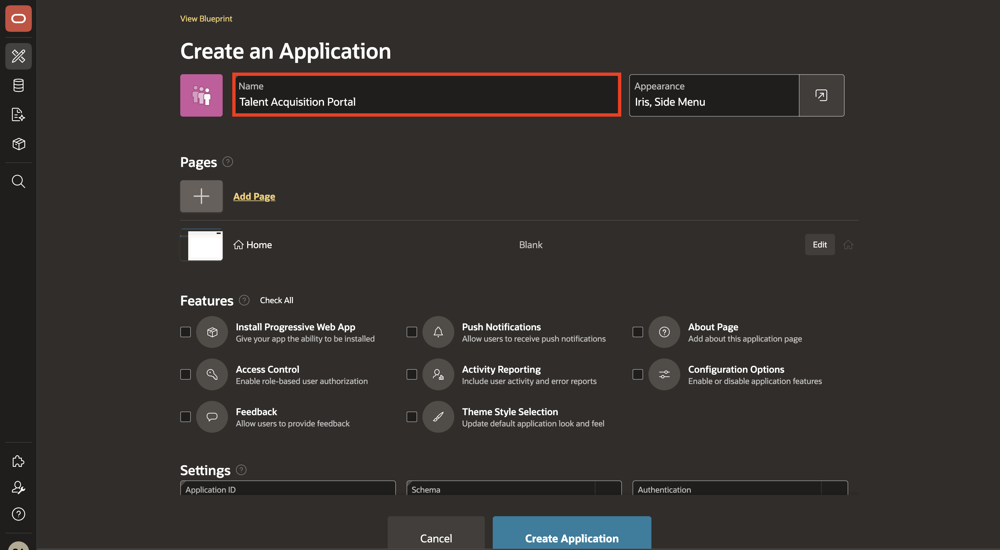

5. To add a **Report with Form** page, click **Add Page**.

    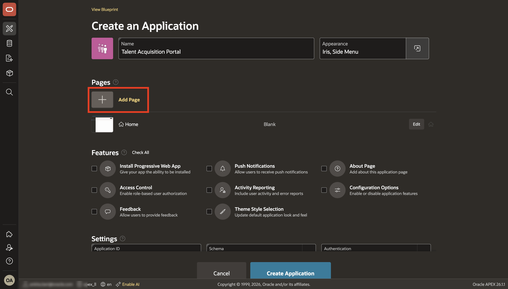

6. Select **Interactive Report**.

    

7. For the Add Report Page, enter or select the following:

    - Page Name: **Job Requisitions**

    - Table or View: **TMS\_JOB\_REQUISITIONS**

    - Include Form: **Toggle On**

    This page gives recruiters a working list of open job requisitions and a form to maintain each requisition.

8. Click **Add Page**.

    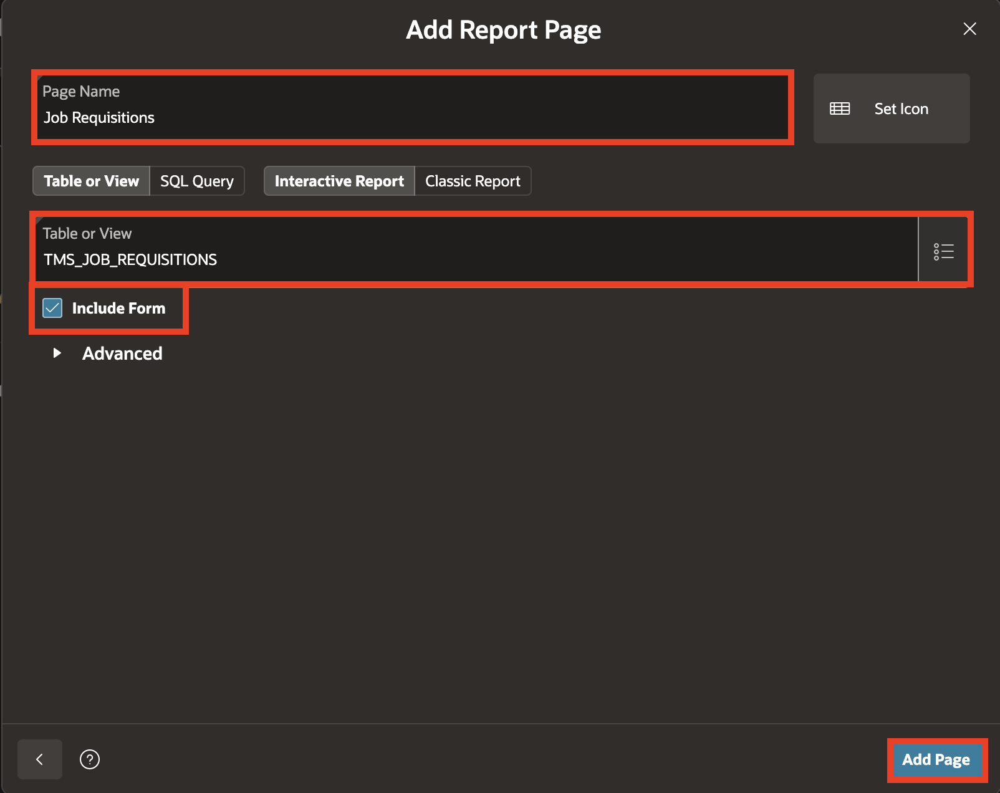

9. On the Create an Application page, click **Add Page** again.

    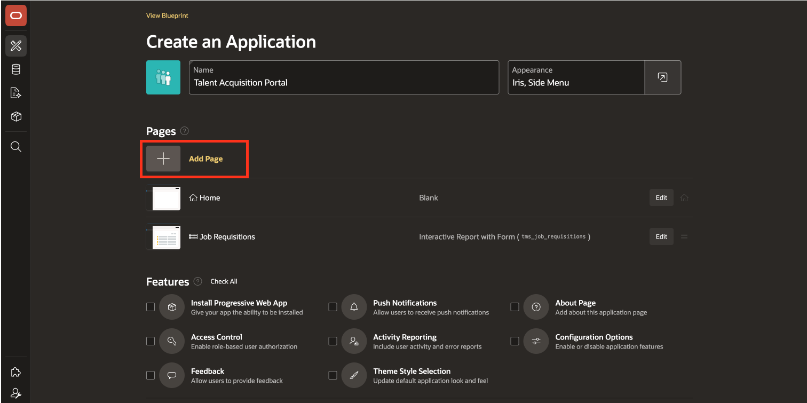

10. Select **Interactive Report**.

    

11. For the Add Report Page, enter or select the following:

    - Page Name: **Candidate Pipeline**

    - Table or View: **TMS_CANDIDATES**

    - Include Form: **Toggle On**

    This page lets recruiters review candidates and update candidate records as they move through the hiring process.

12. Click **Add Page**.

    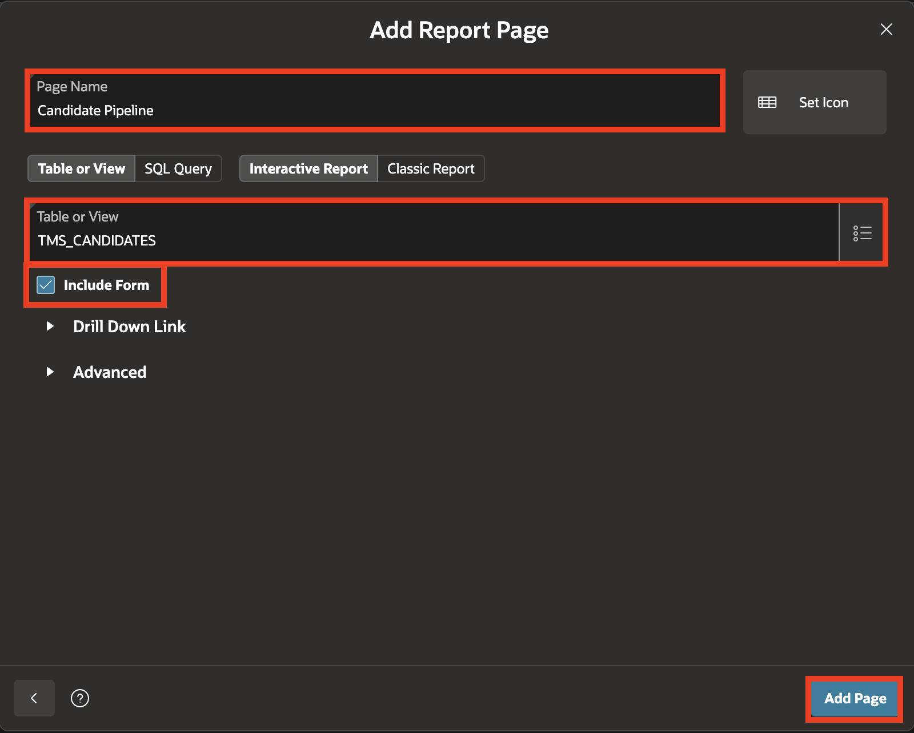

13. On the Create an Application page, click **Add Page** again.

    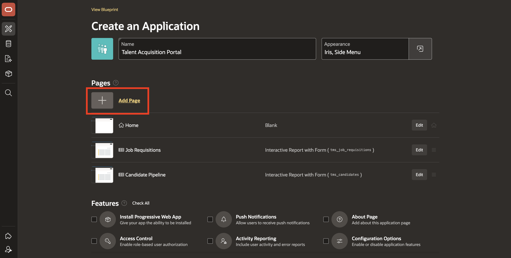

14. Select **Blank**.

    

15. For the page name, enter: **Interview Schedule** and click **Add Page**.

    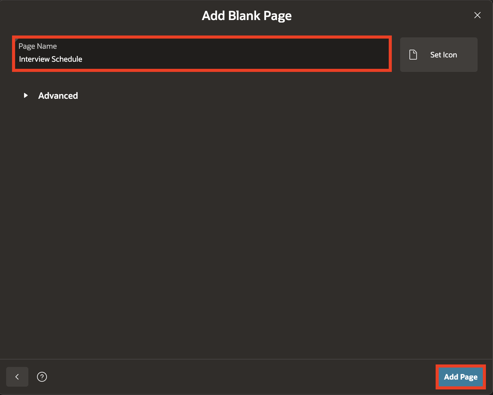

    This blank page reserves a place for interview scheduling functionality that is added in a later module.

16. To add another **Blank Page**, click **Add Page** on the Create an Application page.

17. Select **Blank**.

    

18. For the page name, enter: **Offers** and click **Add Page**.

    

    This blank page reserves a place for offer-related functionality that is added in a later module.

    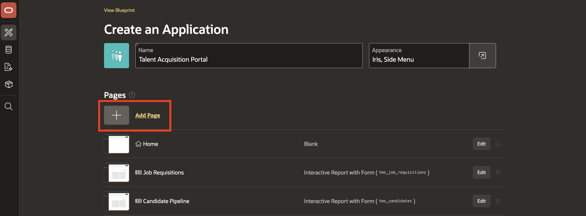

19. Make sure **Appearance** is selected with the default **IRIS** style.

20. Click **Create Application**.

    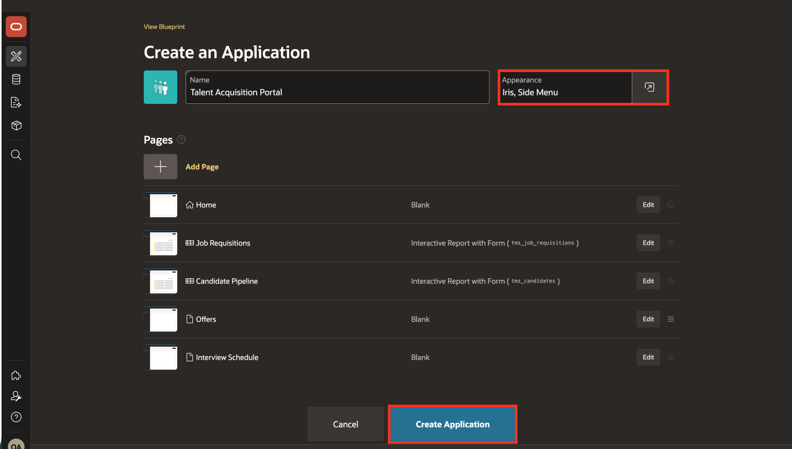

21. Click **Run Application**.

    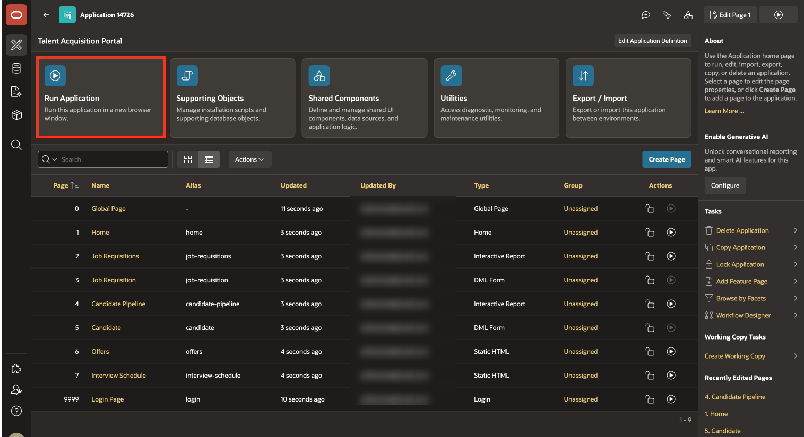

22. Log in to the application.

    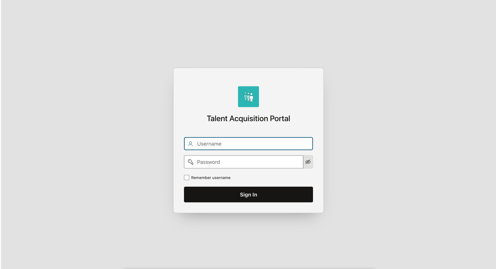

23. Click through all five pages and confirm that the application is live.

    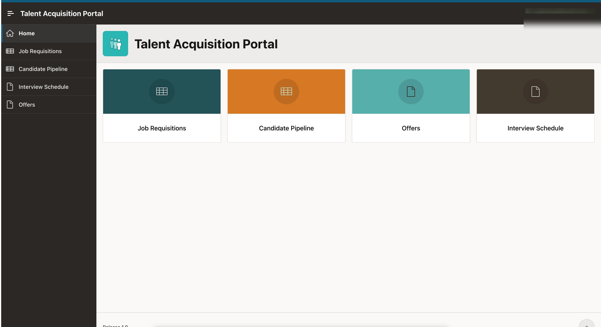

## Summary

In this lab, you created and ran the Talent Acquisition Portal using the Create App Wizard.

- Added interactive report pages with forms for job requisitions and candidates.
- Added blank pages for interview scheduling and offers, ready for functionality in later modules.
- Ran the application and confirmed that its five pages load.

## Acknowledgements

- **Author** - Ankita Beri, Senior Product Manager
- **Last Updated By/Date** - Ankita Beri, Senior Product Manager, July 2026
