# Create the Employee Self-Service Portal using the Create App Wizard

## Introduction

In this lab, you will use the APEX Create App Wizard to build an Employee Self-Service Portal (ESS). You will add an interactive report with a form for onboarding tasks and blank pages for employee profile, leave requests, and payslips, then run the application and confirm that its pages load.

Estimated time: 5 minutes

### Objectives

In this lab, you will:

- Create Employee Self-Service Portal (ESS) using the Create App Wizard.

### What You Will Build

- **Employee Self-Service Portal (ESS)**: Created with the Create App Wizard. It includes Home, My Tasks, My Profile, Leave Request, and My Payslip pages.

## Task 1: Create the Employee Self-Service Portal using the Create App Wizard

In this task, you create the Employee Self-Service Portal application. This application becomes the employee-facing workspace for onboarding tasks, profile details, leave requests, and payslip access.

1. From the left navigation menu, click the **App Builder** icon.

    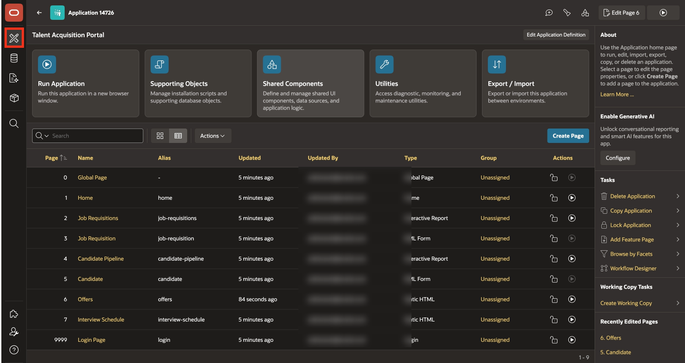

2. Click **Create**.

    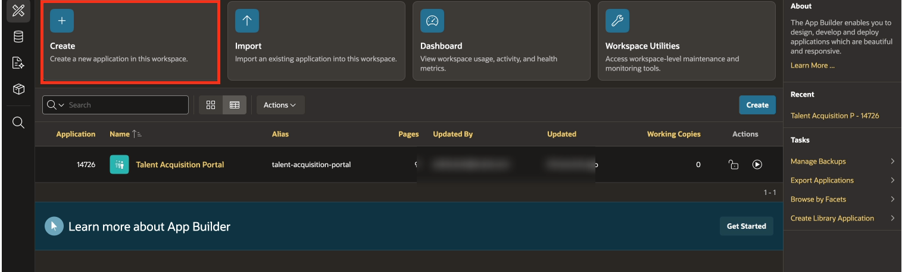

3. Click **Use Create App Wizard**.

    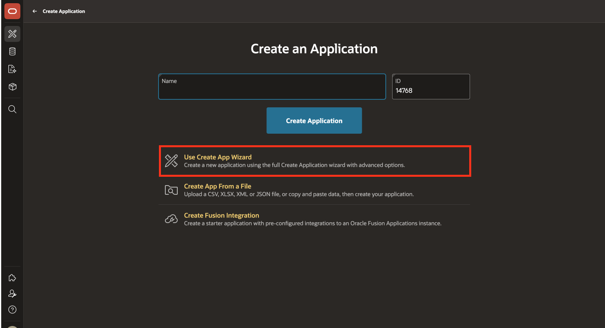

4. For **Name**, enter: **Employee Self-Service Portal**

    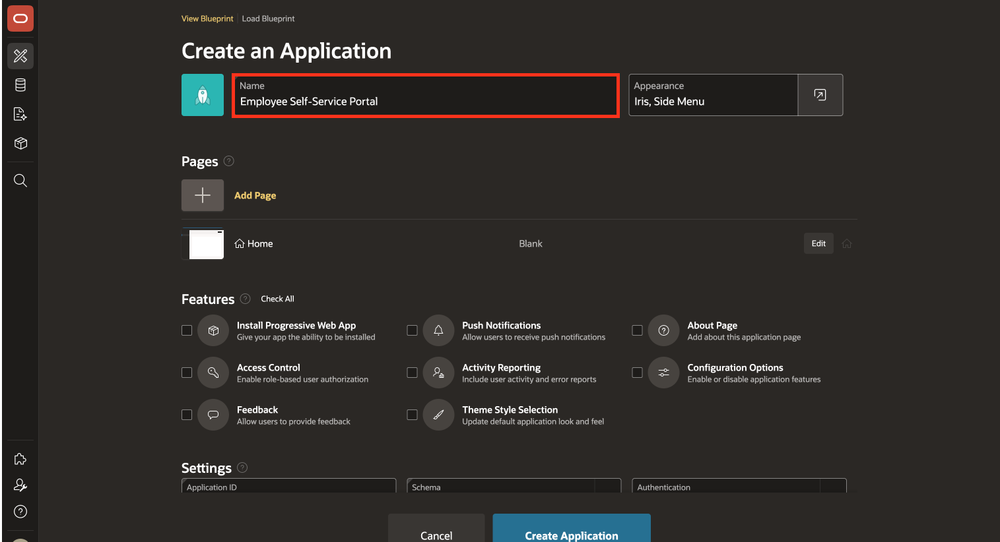

5. To add a **Report with Form** page, click **Add Page**.

    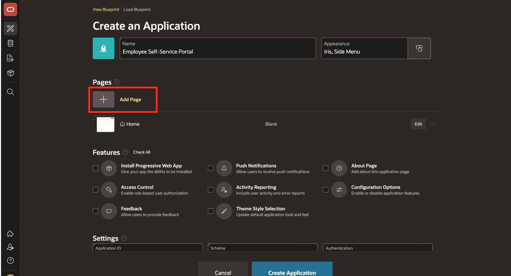

6. Select **Interactive Report**.

    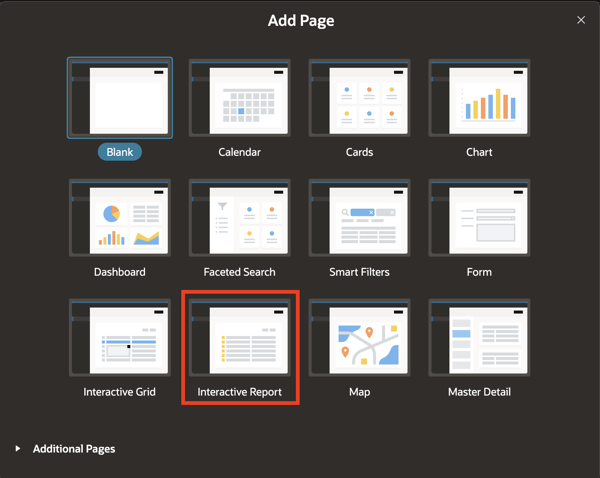

7. For the Add Report Page, enter or select the following:

    - Page Name: **My Onboarding Tasks**

    - Table or View: **TMS\_ONBOARDING\_TASKS**

    - Include Form: **Toggle On**

    This page gives employees a simple place to view and update their onboarding tasks.

8. Click **Add Page**.

    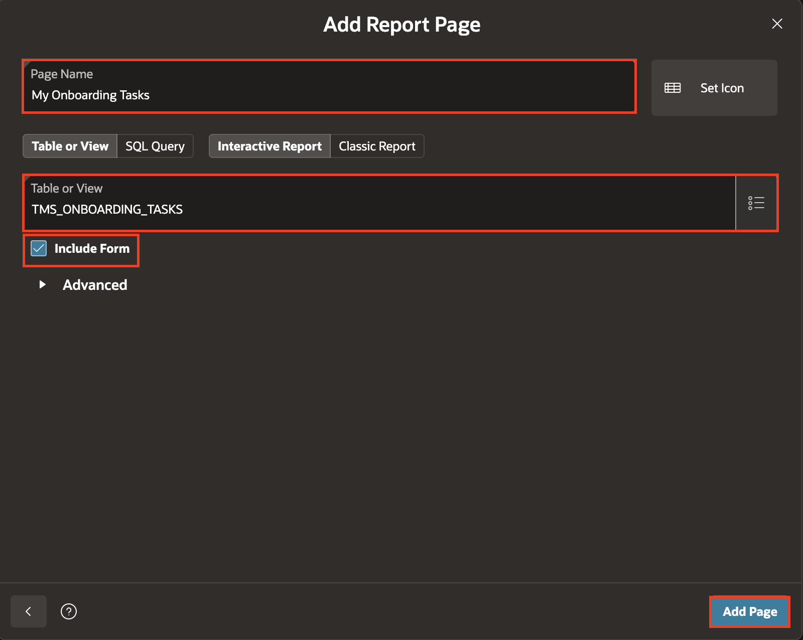

9. On the Create an Application page, click **Add Page** again.

    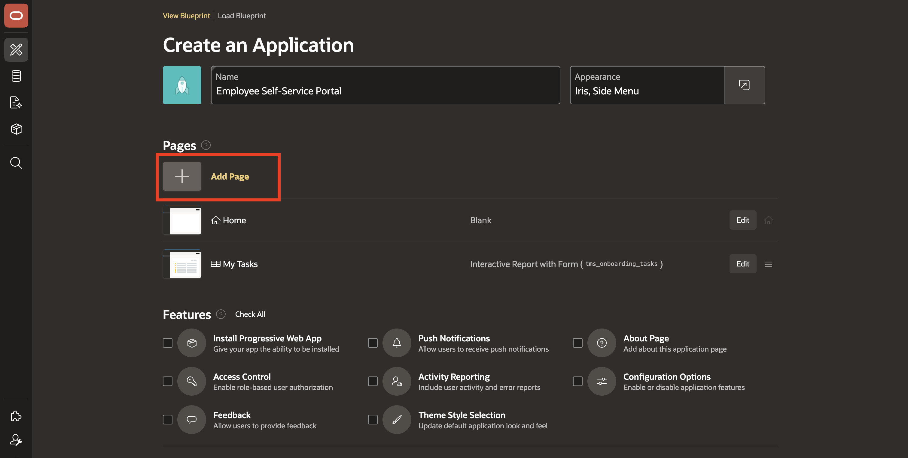

10. Select a **Blank** page.

    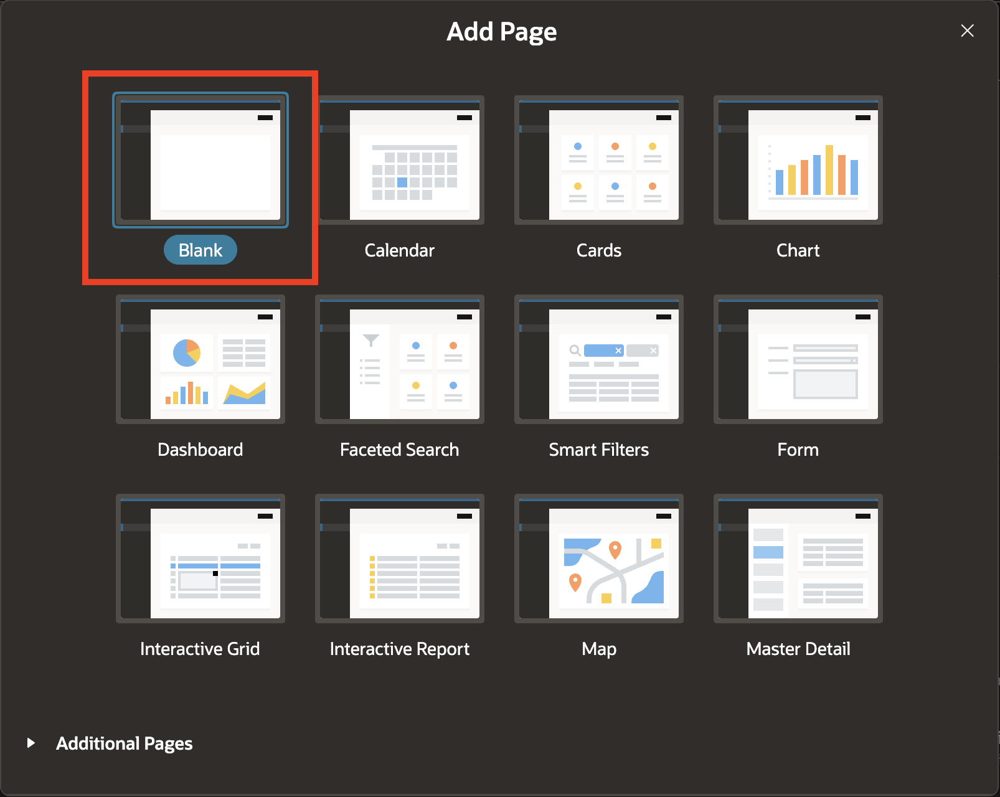

11. For the page name, enter: **My Profile** and click **Add Page**.

    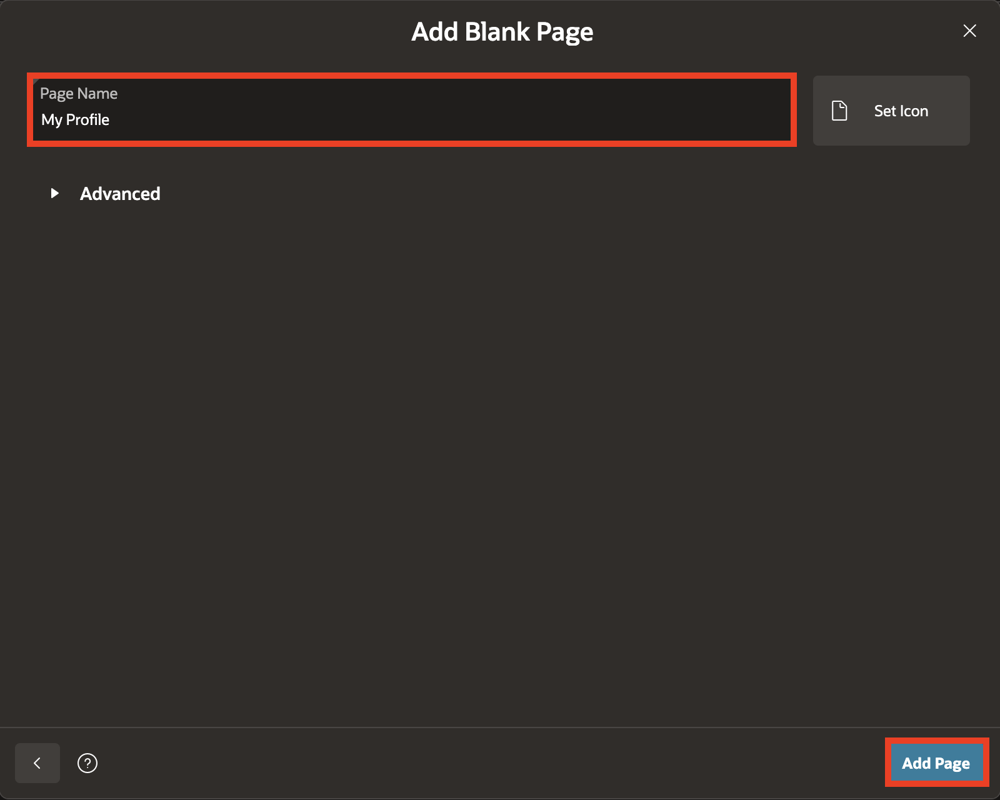

    This blank page reserves a place for employee profile information that is added in a later module.

12. To add another **Blank Page**, click **Add Page**.

    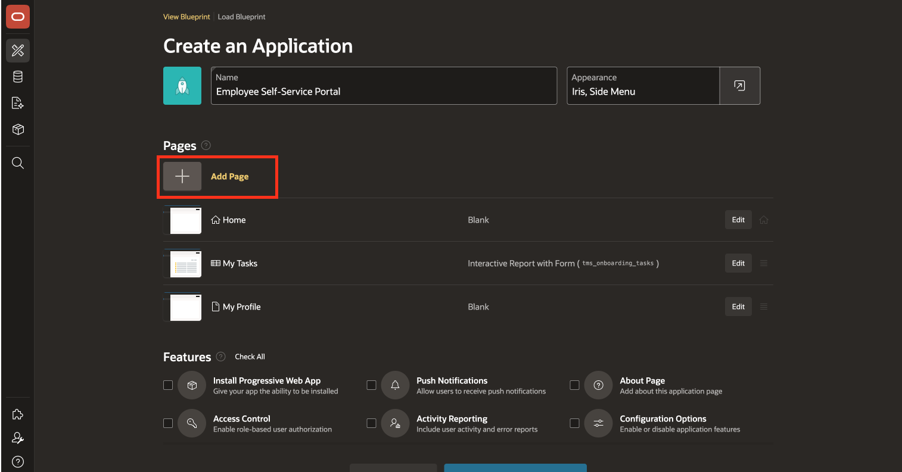

13. For the page name, enter: **Leave Request** and click **Add Page**.

    

    This blank page reserves a place for leave request functionality that is added in a later module.

14. To add another **Blank** page, click **Add Page**.

    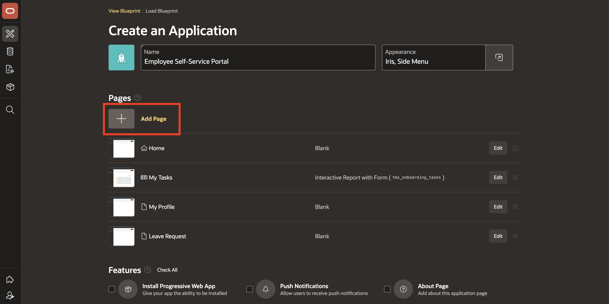

15. For the page name, enter: **My Payslip** and click **Add Page**.

    

    This blank page reserves a place for payslip access that is added in a later module.

16. Click **Create Application**.

    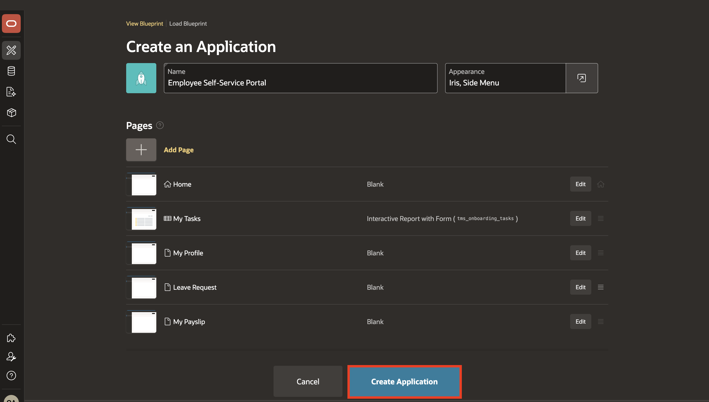

17. Click **Run Application**.

    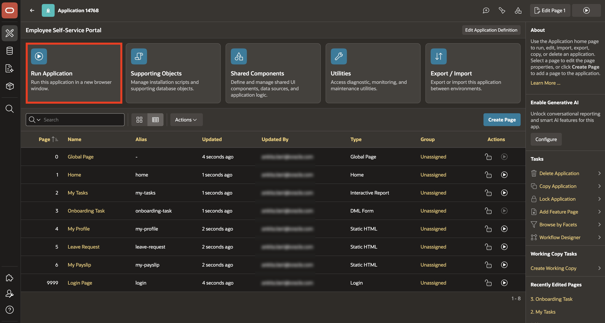

18. Log in to the application.

    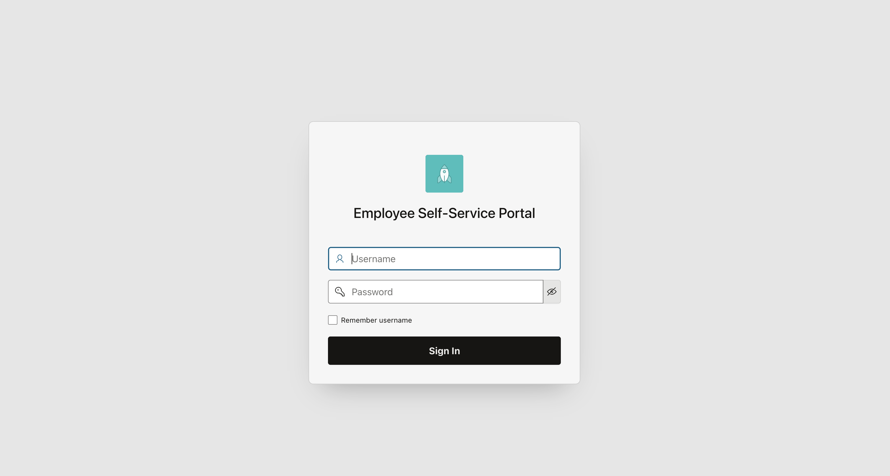

19. Confirm that all five pages load.

    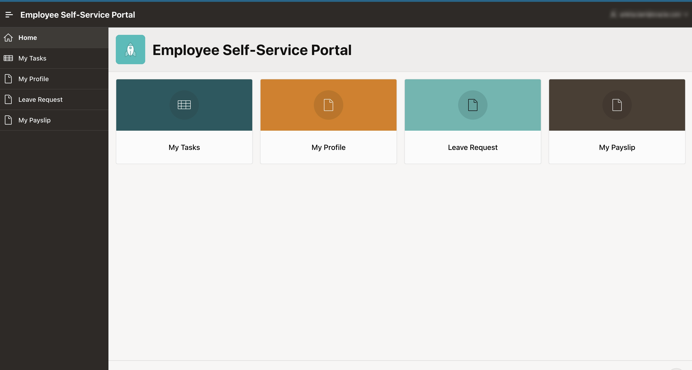

## Summary

In this lab, you created and ran the Employee Self-Service Portal using the Create App Wizard.

- Added an interactive report page with a form for onboarding tasks.
- Added blank pages for employee profile, leave requests, and payslips, ready for functionality in later modules.
- Ran the application and confirmed that its five pages load.

## Acknowledgements

- **Author** - Ankita Beri, Senior Product Manager
- **Last Updated By/Date** - Ankita Beri, Senior Product Manager, July 2026
