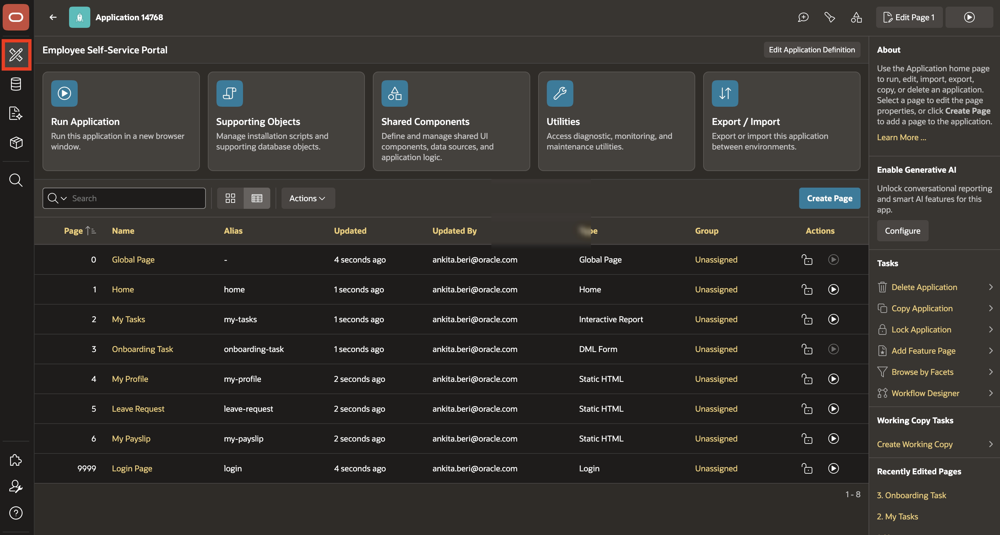
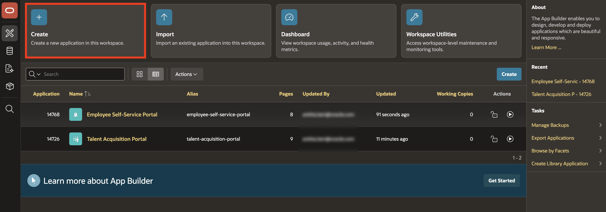
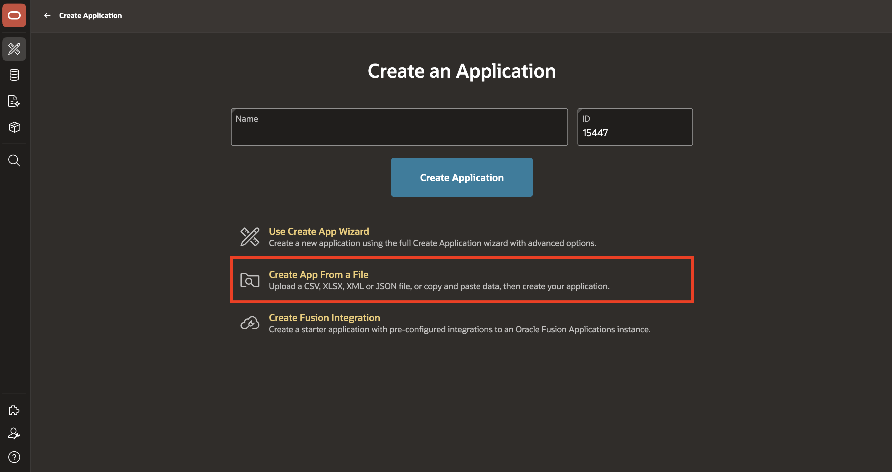
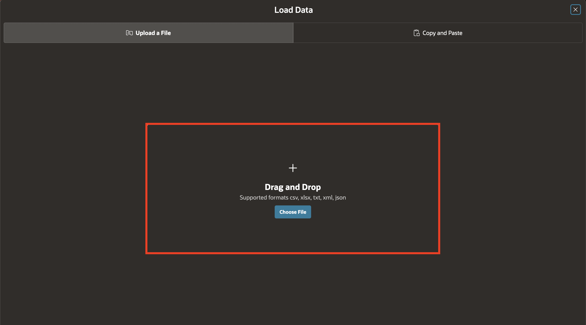
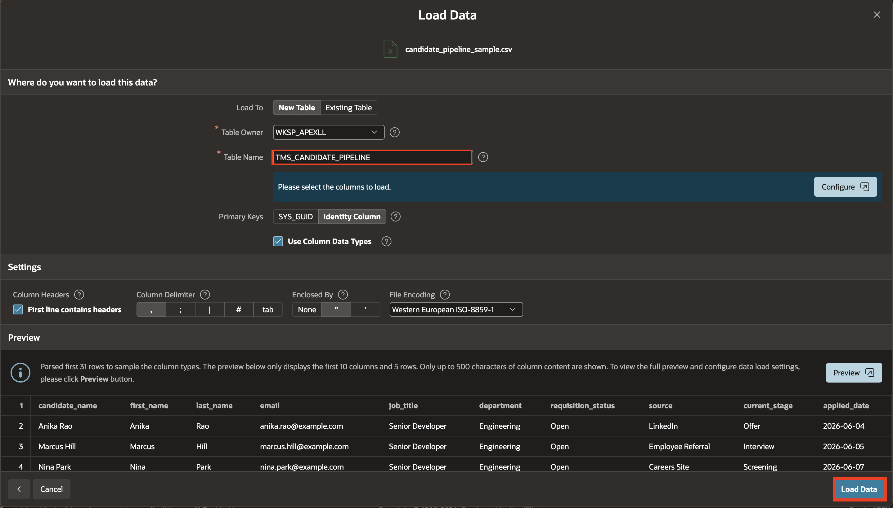
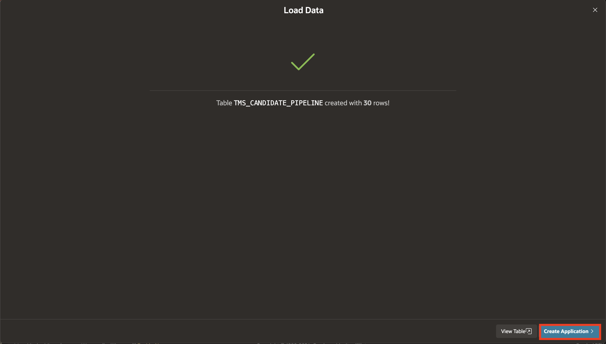
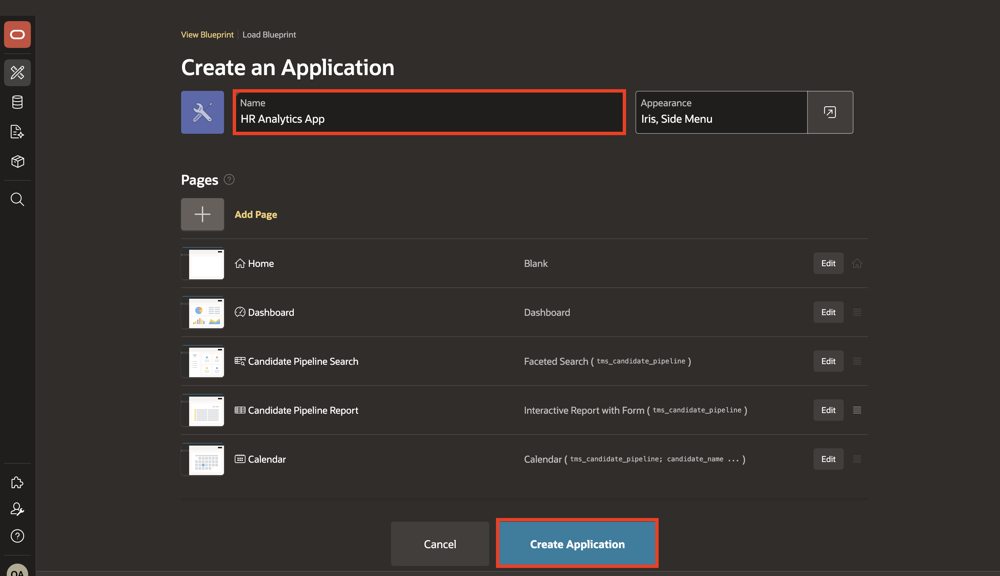
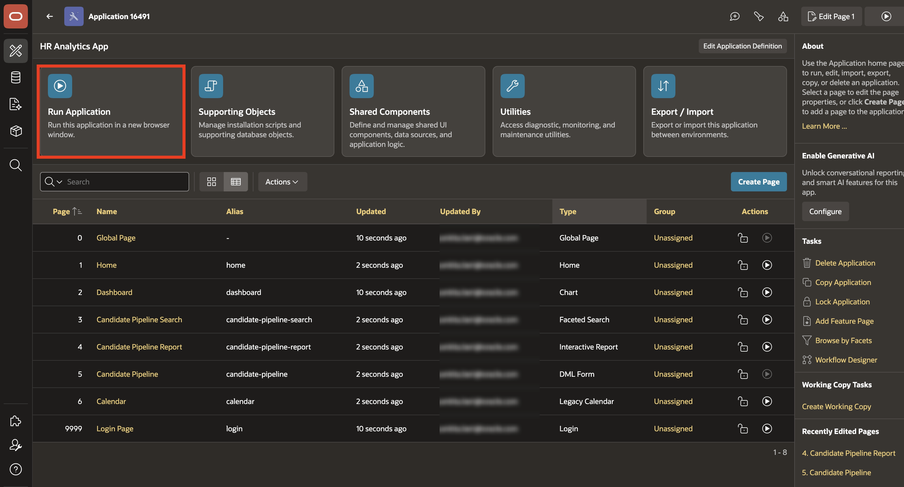
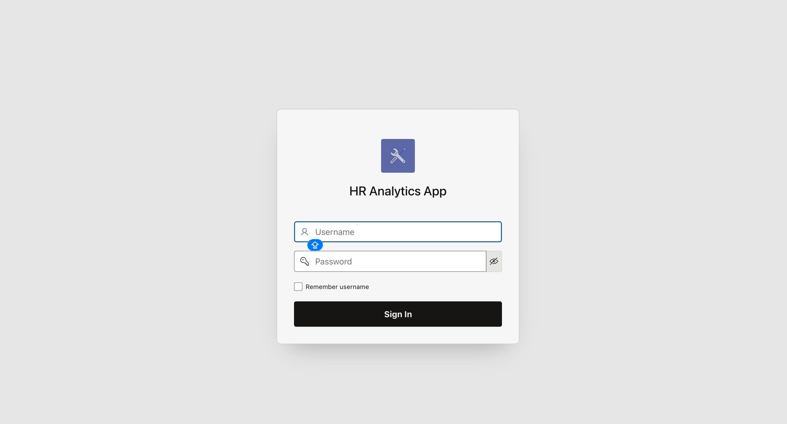
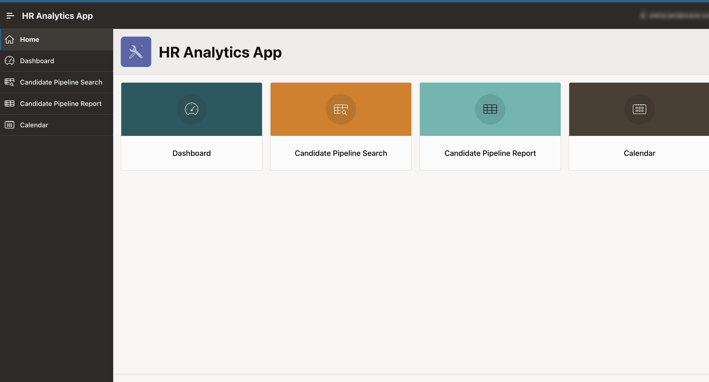

# Create the HR Analytics App from a File

## Introduction

In this lab, you will create an HR Analytics App (HAA) from the provided candidate pipeline CSV file. You will upload the file, load its data into a database table, and let APEX generate a starter application that you can run and review.

Estimated time: 5 minutes

### Objectives

In this lab, you will:

- Create HR Analytics App (HAA) using Application from File.

### What You Will Build

- **HR Analytics App (HAA)**: Created from `candidate_pipeline_sample.csv` using Application from File.

## Task 1: Create the HR Analytics App from a File

In this task, you create the HR Analytics App from a CSV file upload. This application shows how APEX can turn a spreadsheet-style data file into a working application with a table and report pages.

1. Download the provided CSV file:

    [candidate\_pipeline\_sample.csv](files/candidate_pipeline_sample.csv)

    This file contains sample candidate pipeline data that APEX uses to create the starter analytics table.

2. From the left navigation menu, click the **App Builder** icon.

    

3. Click **Create**.

    

4. Select **Create App From a File**.

    

5. Upload or Drag and Drop `candidate_pipeline_sample.csv`.

    

6. For **Table Name**, enter: **TMS\_CANDIDATE\_PIPELINE** and click **Load Data**.

    

    This table stores the uploaded candidate pipeline data for the HR Analytics App.

7. Click **Create Application**.

    

    APEX uses the uploaded data to generate an application with starter pages automatically.

8. For the application **Name**, enter: **HR Analytics App** and click **Create Application**.

    

9. Click **Run Application**.

    

10. Log in to the application.

    

11. Confirm that the generated pages load.

    

    This is a quick starter application.

## Summary

In this lab, you created and ran the HR Analytics App from `candidate_pipeline_sample.csv`.

- Loaded the candidate pipeline data into the `TMS_CANDIDATE_PIPELINE` table.
- Let APEX generate starter application pages from the uploaded data.
- Ran the application and confirmed that the generated pages load.

## Acknowledgements

- **Author** - Ankita Beri, Senior Product Manager
- **Last Updated By/Date** - Ankita Beri, Senior Product Manager, July 2026
