# Add Pages to the Talent Acquisition Portal

## Introduction

In this lab, you will extend the Talent Acquisition Portal with interactive report pages and forms for offers and jobs. APEX uses the existing table definitions and primary keys to create pages for managing records and to recognize relationships between related data.

Estimated time: 5 minutes

### Objectives

In this lab, you will:

- Add table-driven pages to Talent Acquisition Portal (TAP).

## Task 1: Add Pages to the Talent Acquisition Portal

In this task, you add two more table-driven pages to the Talent Acquisition Portal. These pages show how APEX can quickly create working CRUD pages for existing database tables.

1. From the left navigation menu, click the **App Builder** icon.

    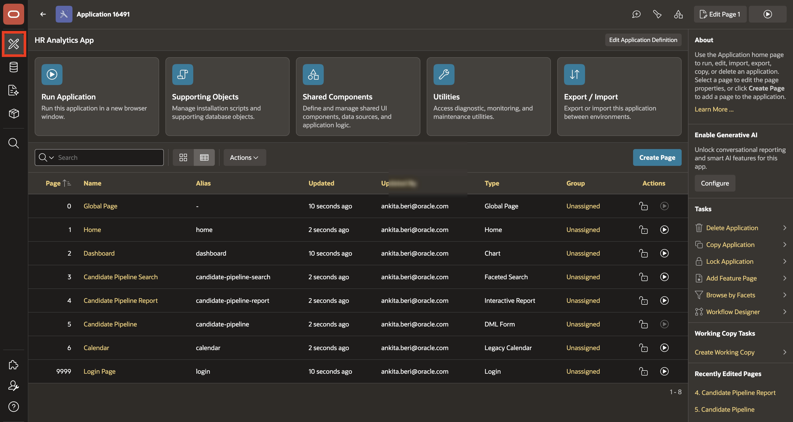

2. Click **Talent Acquisition Portal** application.

    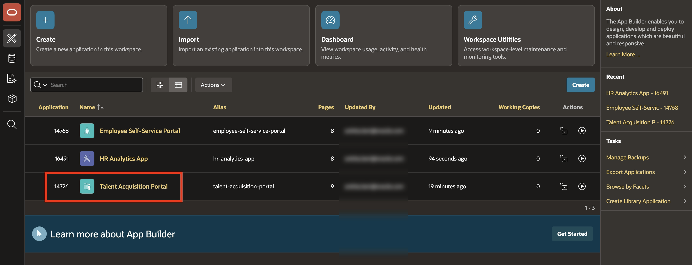

3. Click **Create Page**.

    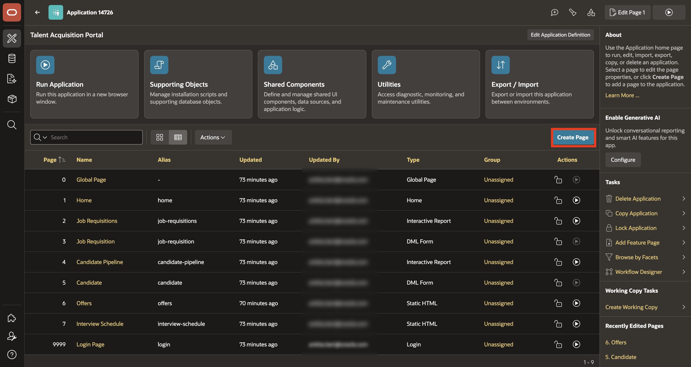

4. Under **Component** tab, select **Interactive Report**.

    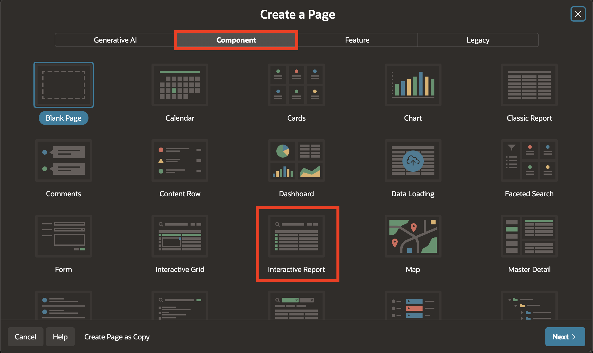

5. For the Create Interactive Report page, enter or select the following:

    - Under Page Definition:

        - Page Name: **Offer Management**

        - Include Form Page: **Toggle On**

        - Form Page Name: **Form on Offers**

    - Under Data Source:

        - Data Source: **Local Database**

        - Table or View: **TMS_OFFERS**

6. Click **Next**.

    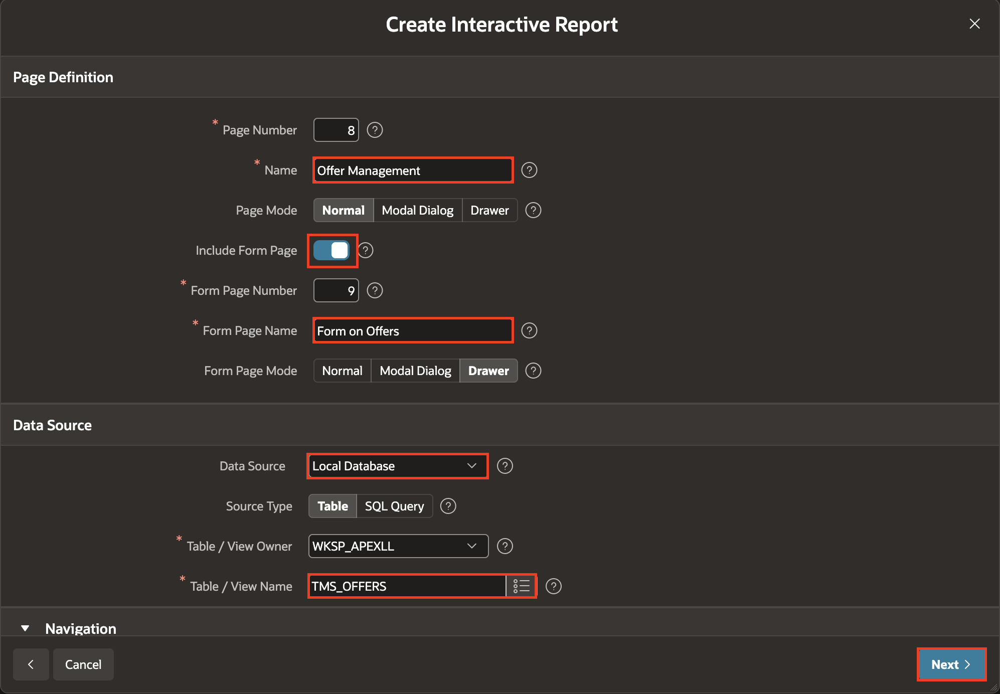

    This page gives recruiters a place to review offer records and open a form for offer details.

7. For **Primary Key Column 1**, select **OFFER_ID (Number)** and click **Create Page**.

    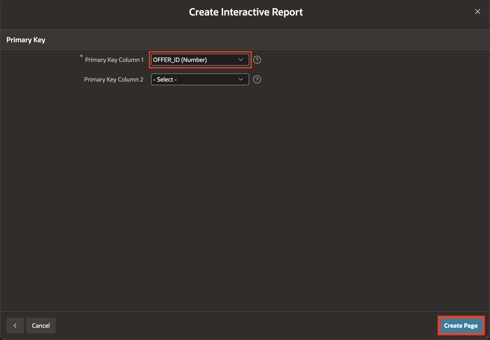

    APEX uses the table metadata to detect relationships to `CANDIDATES` and `JOB_REQUISITIONS`.

8. In Page Designer, click **Save and Run**.

    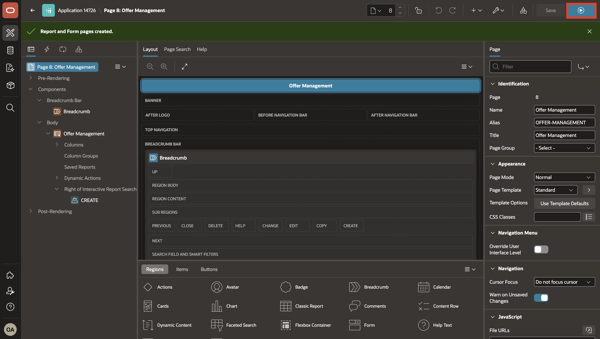

9. Confirm that the page works immediately without additional configuration.

    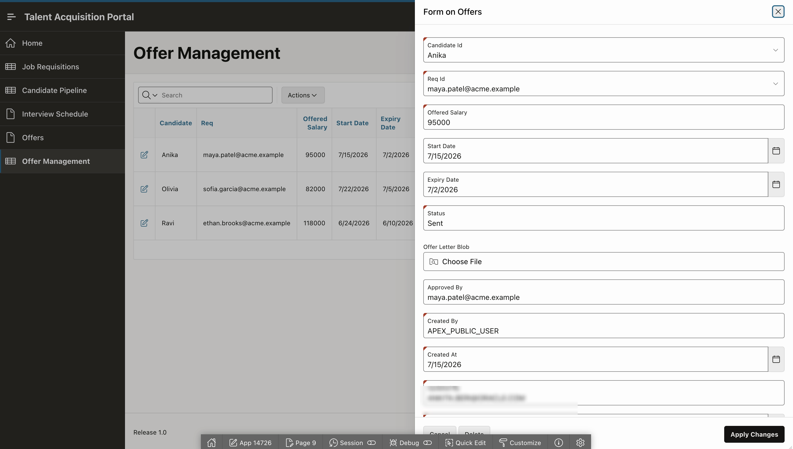

10. Return to App Builder and navigate to Page Designer toolbar, hover over **+v** and select **Page**.

    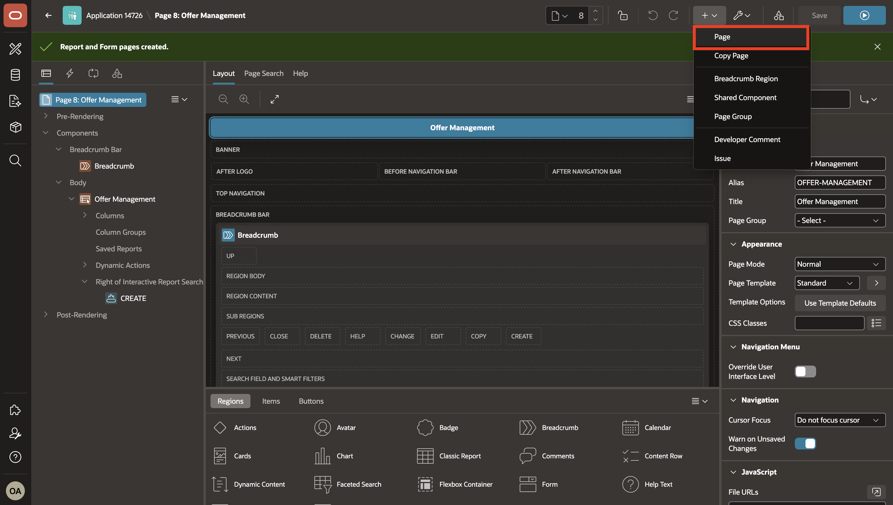

11. Under **Component** tab, select **Interactive Report**.

    

12. For the Create Interactive Report page, enter or select the following:

    - Under Page Definition:

        - Page Name: **Jobs**

        - Include Form Page: **Toggle On**

        - Form Page Name: **Form on Jobs**

    - Under Data Source:

        - Data Source: **Local Database**

        - Table or View: **TMS_JOBS**

13. Click **Next**.

    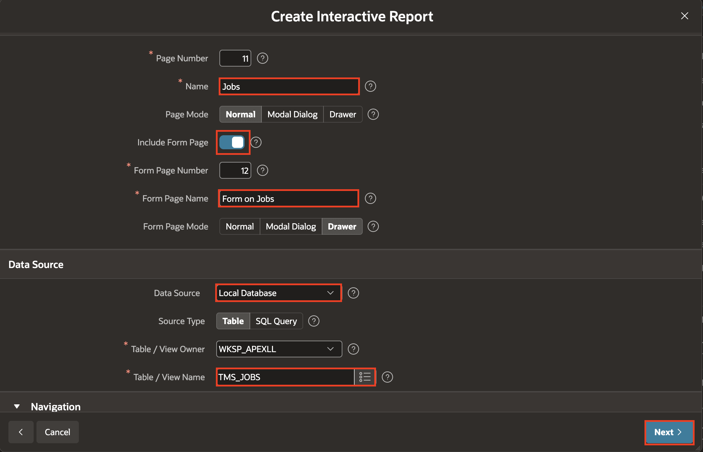

    This page gives administrators a quick way to review and maintain job records used by requisitions.

14. For **Primary Key Column 1**, select **JOB_ID(Number)** and click **Create Page**.

    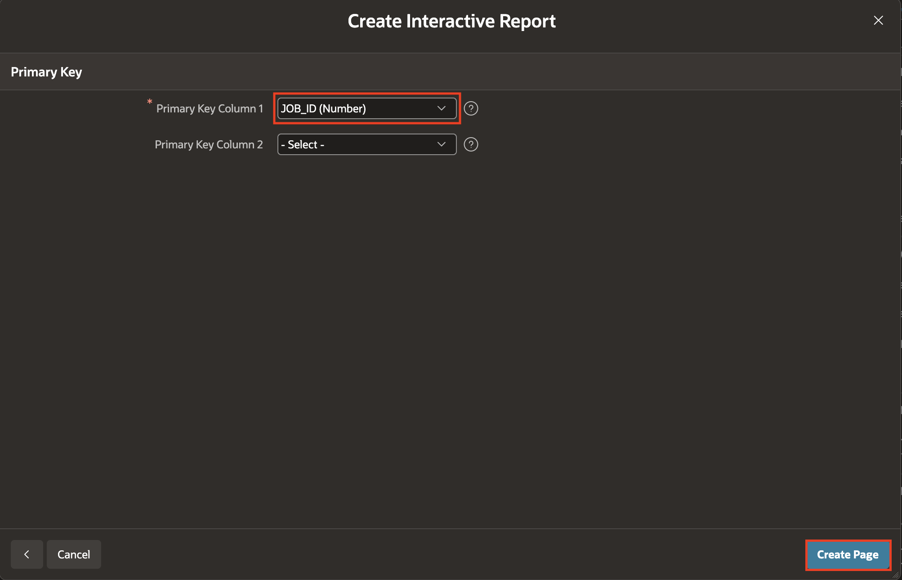

15. In Page Designer, click **Save and Run**.

    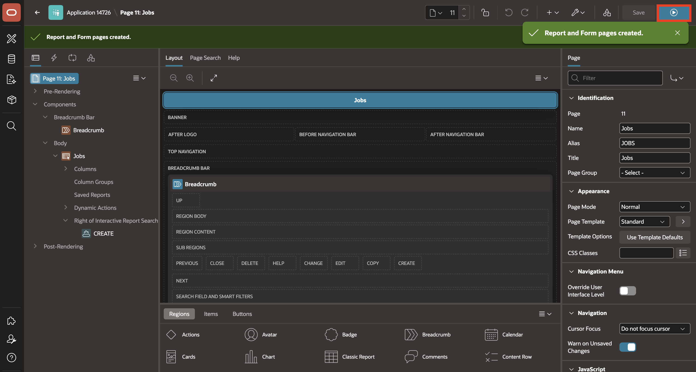

16. Confirm that the Jobs page loads.

    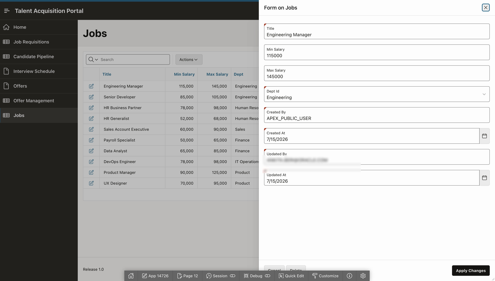

## Summary

In this lab, you added and ran two table-driven pages in the Talent Acquisition Portal.

- Created an Offer Management interactive report and form based on `TMS_OFFERS`.
- Created a Jobs interactive report and form based on `TMS_JOBS`.
- Selected each table's primary key and confirmed that the generated pages load.

## Acknowledgements

- **Author** - Ankita Beri, Senior Product Manager
- **Last Updated By/Date** - Ankita Beri, Senior Product Manager, July 2026
