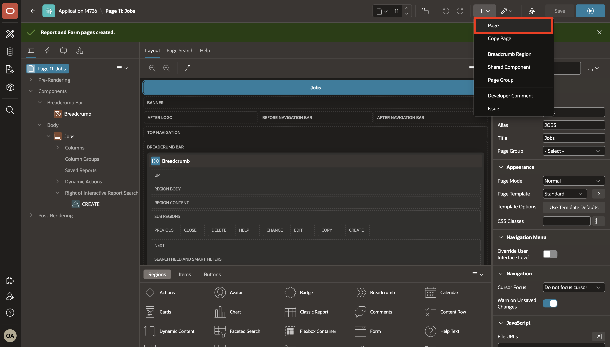
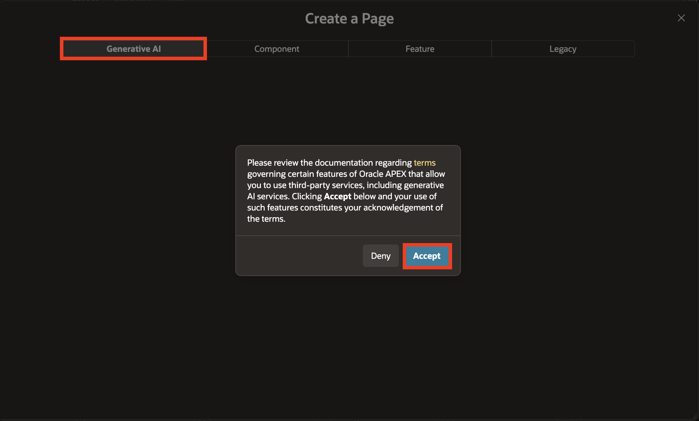
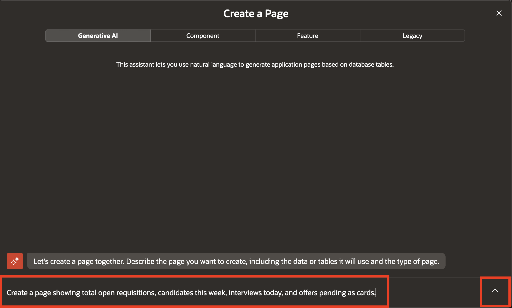
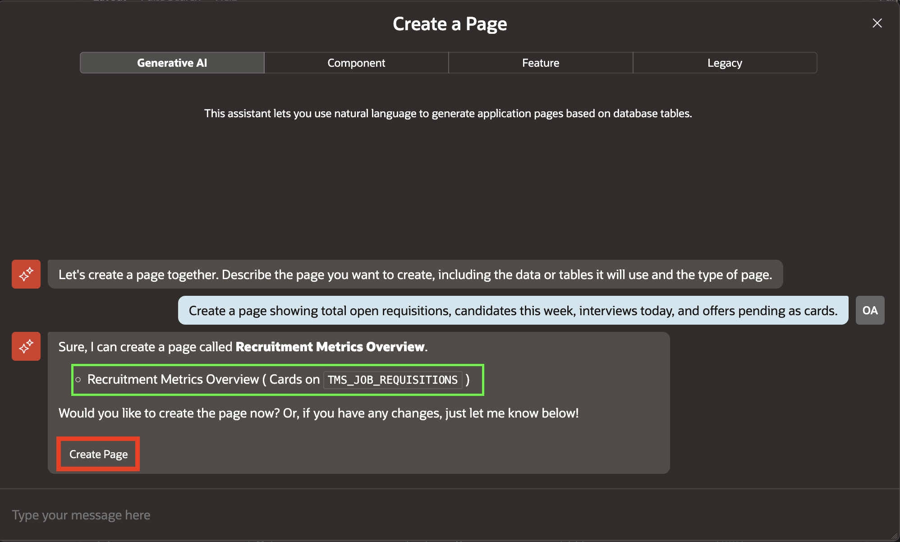
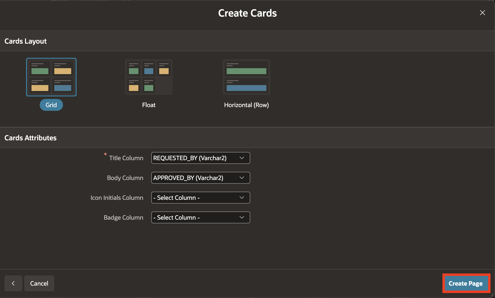
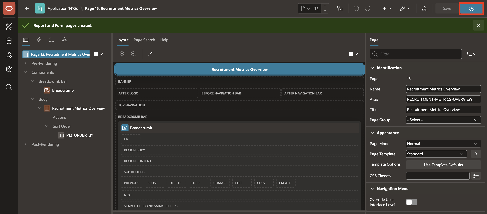

# Create a Page using Natural Language

## Introduction

In this lab, you will use APEX Generative AI to create a cards page for the Talent Acquisition Portal from a natural-language prompt. You will review the generated recruiting metrics layout, create the page, and run it in Page Designer.

Estimated time: 5 minutes

### Objectives

In this lab, you will:

- Create the Cards page using Natural Language.

## Task 1: Create a Page using Natural Language

In this task, you use Generative AI to create the Talent Acquisition Portal page. The cards page gives recruiters a high-level view of open requisitions, candidate activity, interviews, and pending offers.

1. Return to **App Builder** and navigate to Page Designer Toolbar, hover over **+v** and select **Page**.

    

2. On the Create a Page page, select **Generative AI** tab.

3. If prompted, accept the Generative AI terms.

    

4. Enter the following prompt and click the send icon:

    ```
    <copy>
    Create a page showing total open requisitions, candidates this week, interviews today, and offers pending as cards
    </copy>
    ```

    

    This prompt asks APEX AI to create metric cards that summarize the recruiting pipeline.

5. Review the generated cards page and click **Create Page**.

    

6. Review the cards layout and attributes settings and click **Create Page**.

    

7. In Page Designer, click **Save and Run**.

    

8. Observe the generated cards page.

## Summary

In this lab, you used a natural-language prompt to generate and run a Recruitment Metrics cards page for the Talent Acquisition Portal.

- Asked APEX Generative AI to display open requisitions, candidates this week, interviews today, and pending offers.
- Reviewed the generated cards layout and page attributes.
- Created the page and ran it to view the recruiting metrics.

## Acknowledgements

- **Author** - Ankita Beri, Senior Product Manager

- **Last Updated By/Date** - Ankita Beri, Senior Product Manager, July 2026
